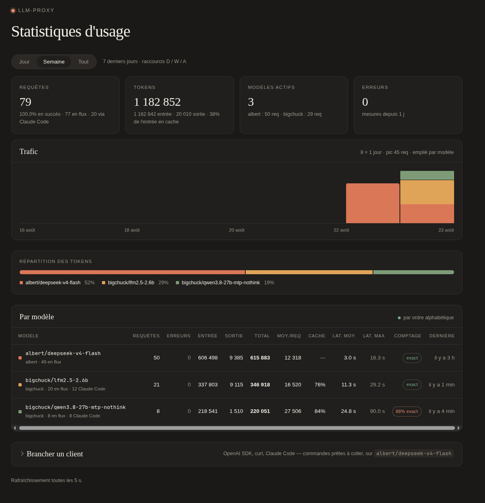

# llm-proxy

Passerelle OpenAI-compatible qui expose **plusieurs backends LLM derrière
un seul endpoint** : Albert (DINUM), machines llama.cpp locales, ou tout
autre serveur compatible OpenAI. Le client parle à une seule URL et
choisit le backend par le **préfixe du nom de modèle**
(`albert/deepseek-v4-flash`, `bigchuck/qwen3-32b`). Un client écrit pour
l'API Anthropic — **Claude Code** — s'y branche aussi, le proxy traduit.



## Fonctionnalités

- **Configuration en un seul fichier** — tout vit dans
  `data/config.toml` (voir [Configuration](#configuration)). L'environnement
  ne sert plus qu'aux **secrets**, injectés dans le TOML par `${VAR}`.
- **Routage multi-backends** — une table `[backends.<nom>]` par backend ;
  le nom est le discriminant de routage, retiré avant transfert
  (llama.cpp reçoit `qwen3-32b`, pas `bigchuck/qwen3-32b`).
- **Catalogue unifié** — `GET /v1/models` interroge tous les backends en
  direct, préfixe les ids et **normalise les entrées sur un schéma
  uniforme** (type, coûts, `max_context_length` dérivé du `--ctx-size`
  ou du `n_ctx_train` côté llama.cpp) ; les détails internes (chemins
  `.gguf`, args…) ne sont jamais publiés. Les noms renvoyés sont
  directement routables.
- **Limiteur de quotas Albert** — temporise les requêtes pour rester
  sous les limites du compte (fenêtres minute **et** jour, chargées via
  `/v1/me/info`, rafraîchies périodiquement). Retarde plutôt que
  rejeter ; si l'attente dépasse `quotas.max_queue_seconds` (quota journalier
  épuisé) → 429 local avec `Retry-After`. Un client qui raccroche pendant
  l'attente quitte la file sans rien consommer (compté `499`) : un SDK qui
  retente sur timeout n'empile pas de doublons facturés. Plusieurs backends
  à quotas possibles (deux comptes Albert = deux jeux de limiteurs
  indépendants).
- **Backends locaux à la demande** — jamais sondés en tâche de fond
  (souvent éteints) : connexion coupée à 1 s, backend éteint → 503
  `backend_offline` avec `Retry-After`, et simplement absent de
  `/v1/models`.
- **Clé centralisée** — la clé Albert ne vit que dans le proxy ;
  l'`Authorization` du client est remplacé. Les clients n'ont rien à
  configurer (une valeur bidon suffit si leur SDK exige une clé).
- **Correctif `tool_choice`** — quand `tools` est présent sans
  `tool_choice`, le proxy peut injecter `tool_choice: "auto"` (le schéma
  d'Albert déclare `"default": "none"`, ce qui casse le tool calling des
  agents). **Rien n'est injecté par défaut** : le correctif s'active
  backend par backend (`force_tool_choice`), là où il est nécessaire. Un
  `tool_choice` explicite du client n'est jamais écrasé.
- **Surface minimale** — seuls `POST /v1/chat/completions`,
  `GET /v1/models` et les chemins de `FORWARD_POST_PATHS` sont relayés ;
  toute autre URL → 404 local `unknown_route`. Le streaming SSE passe
  intact.
- **Compatible Claude Code** — si `[anthropic].enabled`, le proxy parle
  aussi l'**API Messages d'Anthropic** : `POST /v1/messages` (JSON et
  flux SSE, outils compris), `/v1/messages/count_tokens`, et
  `GET /v1/models` à la forme Anthropic. Traduit vers
  `/v1/chat/completions` du backend visé — **uniquement dans ce sens**,
  aucun backend Anthropic. Voir [Claude Code](#claude-code).
- **Plafond `max_tokens`** — optionnel, par backend : la valeur du
  client est ramenée au plafond (Claude Code en demande 32 000).
- **Observabilité** — `GET /healthz` expose l'état de chaque backend
  (URL, quotas restants par fenêtre, derniers modèles vus, réglages
  `tool_choice` / `max_tokens` / `images` / `tokenize_path`) et de la
  surface Anthropic ; un résumé périodique des compteurs est loggé
  (`quotas.status_interval`), et toute erreur upstream (4xx/5xx) l'est
  avec le début de son corps — le client, lui, ne voit souvent qu'un
  statut.
- **Statistiques persistantes, à la forme d'OpenAI** —
  `GET /v1/organization/usage/completions` : **l'Usage API d'OpenAI**,
  servie depuis les compteurs du proxy. Une ligne SQLite par requête
  (`data/stats.db`), donc les chiffres survivent au redémarrage et toute
  fenêtre temporelle est calculable après coup. C'est la **seule**
  lecture des statistiques — il n'existe pas de format privé, et le
  SDK OpenAI officiel s'y branche tel quel (voir
  [Statistiques](#statistiques-usage-api)).
- **Tableau de bord** — `GET /ui` (ou `/`) : une page Vue 3 qui consomme
  cette même Usage API, en vues **Jour / Semaine / Tout**
  (voir [Tableau de bord](#tableau-de-bord)).

## Fichiers

| Fichier | Rôle |
|---|---|
| `main.py` | Point d'entrée (`uvicorn main:app`) — trois lignes, tout le code est dans le paquet |
| `llm_proxy/config.py` | Chargement de `data/config.toml` : substitution des `${VAR}`, accès typés, création du fichier depuis l'exemple au premier démarrage |
| `llm_proxy/settings.py` | La table `[proxy]`, en constantes typées |
| `llm_proxy/backends.py` | Déclaration des backends, clients HTTP, **routage au préfixe de modèle** |
| `llm_proxy/albert.py` | Tout ce qui est spécifique à Albert : limiteur de quotas (fenêtres minute/jour), familles de modèles, association routeurs ↔ modèles via `/v1/me/info` |
| `llm_proxy/stats.py` | Compteurs persistés en SQLite (une ligne par requête), extraction de l'`usage` dans le flux de réponse, et l'Usage API |
| `llm_proxy/anthropic_api.py` | La surface Anthropic : traduction Messages ↔ chat/completions, flux SSE compris ; `model_map` |
| `llm_proxy/app.py` | L'application FastAPI : routes, auth, relais, `/v1/models` fusionné |
| `tests/` | Tests du traducteur et des stats (`pytest`, `requirements-dev.txt`) — sur des octets et une base temporaire, sans réseau |
| `envTest/` | Validation avec de **vrais clients** en conteneurs jetables : Claude Code et pi, scénarios PASS/FAIL — voir `envTest/README.md` |
| `llm_proxy/web/` | Le tableau de bord : `templates/index.html` (le gabarit Vue, servi tel quel) et `static/` (`dashboard.js`, `dashboard.css`, `vue.global.prod.js`) |
| `data/config.example.toml` | Le modèle de configuration, documenté — copié en `data/config.toml` au premier démarrage |

`app.py` ne connaît d'Albert que « un backend `quotas = true` passe par
sa `QuotaState` » ; toute la mécanique de quotas vit dans `albert.py`.

Chaque requête relayée est portée par un objet `Call` (backend, modèle
demandé, endpoint, dialecte du client) : c'est lui qui écrit la ligne de
stats — une fois, quel que soit le chemin de sortie — et construit les
erreurs à la forme attendue (`{"error": {…}}` ou, pour un client
Anthropic, `{"type": "error", …}`). La porte de quota (`gate`) et le
relais (`forward`) sont communs à toutes les routes ; `forward` fait
passer les octets upstream par un « robinet » — `stats.UsageCollector`
(identité, lit l'`usage` au passage) ou `anthropic_api.Translator`
(réécrit la réponse).

`data/` est le seul dossier écrit à l'exécution (`config.toml`,
`stats.db`) : c'est le volume à monter.

## Statistiques (Usage API)

Les compteurs sont **persistés** : une ligne SQLite par requête servie
(`data/stats.db`), écrite hors de la boucle d'événements par un thread
dédié. Ils survivent donc au redémarrage, et n'importe quelle fenêtre
temporelle se calcule après coup. Purge automatique au-delà de
`stats.retention_days` (90 jours par défaut, `0` = illimité).

La seule route de lecture est **l'Usage API d'OpenAI** :

    GET /v1/organization/usage/completions
        ?start_time=<epoch>        (obligatoire)
        &end_time=<epoch>
        &bucket_width=1m|1h|1d|all
        &group_by[]=model
        &models[]=albert/openweight-large
        &limit=<n>&page=<curseur>

Réponse : `page` → `bucket` → `result`, au schéma OpenAI exact. Le SDK
officiel s'y branche sans adaptation :

```python
from openai import OpenAI
c = OpenAI(base_url="http://localhost:8000/v1", api_key="x", admin_api_key="x")
page = c.admin.organization.usage.completions(
    start_time=..., bucket_width="1d", group_by=["model"], limit=7)
```

Deux écarts, **tous deux additifs** — un SDK ignore ce qu'il ne connaît
pas, la compatibilité reste entière :

- `bucket_width=all` en plus de `1m`/`1h`/`1d` : un seul seau couvrant
  toute la plage, pour obtenir un total sans agréger soi-même ;
- `input_cached_tokens` est **renseigné** quand le backend dit ce qu'il a
  servi depuis son cache de préfixe (`prompt_tokens_details.cached_tokens`
  — llama.cpp, vLLM, OpenAI) ; `0` sinon, jamais une valeur inventée.
  Inclus dans `input_tokens`, comme chez OpenAI ;
- chaque `result` porte, en plus des champs du schéma, ce que le proxy
  sait mesurer et qu'OpenAI n'expose pas : `num_errors`,
  `num_streamed_requests`, `num_estimated_requests`,
  `num_anthropic_requests` (arrivées par `/v1/messages`, donc Claude
  Code), `total_latency_seconds`, `avg_latency_seconds`,
  `max_latency_seconds`, `first_request_time`, `last_request_time`.

**Toutes ces grandeurs s'agrègent sans perte** : elles s'additionnent
(requêtes, tokens, somme des latences) ou se maximisent (latence max).
Un client peut donc recomposer n'importe quelle période à partir de
seaux plus fins et retrouver *exactement* ce qu'aurait rendu un seau
unique — à condition d'aligner `start_time` sur la largeur des seaux,
puisqu'ils se calent sur des multiples depuis l'epoch. C'est ce qui
permet au tableau de bord de tout tirer d'un seul appel. Il n'y a
volontairement **pas de percentile** : un p95 n'a pas cette propriété,
il imposerait un appel séparé et une requête de tri par partition.

Le champ `model` est le nom **préfixé** (`albert/openweight-large`),
donc directement réutilisable comme `model` d'une requête. Les
dimensions que le proxy ne possède pas (`project_id`, `user_id`,
`api_key_id`, `batch`) valent `null` ; **filtrer** dessus rend une page
vide, plutôt que d'ignorer le filtre en silence et de sur-déclarer
l'usage.

Comptage des tokens : le bloc `usage` de l'upstream quand il existe —
streaming SSE compris —, sinon une estimation à ~4 caractères par
token. Les deux sont comptés séparément (`num_estimated_requests`) pour
que le chiffre affiché reste honnête. Une requête **en erreur** sans
`usage` (500 upstream, 429 local, client parti) compte **0 token,
exact** : rien n'a été consommé de mesurable, et le corps envoyé n'a pas
à gonfler l'entrée.

## Tableau de bord

`GET /ui` (ou `/`) — c'est la copie d'écran ci-dessus. La page est servie
telle quelle : le serveur ne calcule aucun balisage. Le gabarit est
**déclaratif, écrit dans le HTML**, et rendu par **Vue 3** — build complet
embarqué localement (`/ui/static/vue.global.prod.js`), donc **aucun CDN et
aucune étape de compilation**. `dashboard.js` ne contient que l'état et
les valeurs dérivées ; rien n'y touche au DOM.

Trois vues, sélecteur en haut de page :

| Vue | Période | Découpage | Raccourci |
|---|---|---|---|
| Jour | 24 dernières heures | 1 heure | <kbd>D</kbd> |
| Semaine | 7 derniers jours | 1 jour | <kbd>W</kbd> |
| Tout | depuis le plus ancien enregistrement | 1 heure ou 1 jour, selon l'étendue | <kbd>A</kbd> |

Et **deux lectures du même trafic**, second sélecteur juste à côté :
*Requêtes* (<kbd>R</kbd>) ou *Tokens* (<kbd>T</kbd>). C'est la mesure que
porte la courbe **Trafic** — hauteur des barres, partage entre modèles,
pic annoncé. Les deux grandeurs sont déjà dans la réponse : basculer ne
redemande rien au proxy, les mêmes barres glissent simplement vers leur
nouvelle hauteur.

Les deux choix sont mémorisés (`localStorage`). **Un seul appel par
rafraîchissement** : les seaux de la période, groupés par modèle. Totaux,
ligne par modèle et courbe s'en déduisent, puisque tout ce qu'expose
l'API s'additionne ou se maximise. La borne de départ est alignée sur la
largeur des seaux, si bien que les chiffres du tableau portent exactement
sur ce que montre la courbe. Un second appel, léger, sert uniquement à
savoir jusqu'où remonte l'historique — au chargement et au changement de
période, jamais dans la boucle.

Rien n'est demandé tant que l'onglet est masqué ; au retour, la page se
rafraîchit immédiatement plutôt que d'afficher des chiffres périmés.

Le rafraîchissement de 5 s ne clignote pas : Vue rapproche les listes par
leur clé et ne réécrit que ce qui a changé, si bien que les nœuds
survivent d'un cycle à l'autre. Ils gardent donc leurs transitions en
cours, le survol et la sélection de texte — et les barres **glissent**
vers leur nouvelle hauteur au lieu d'y sauter.

Au changement de période, en revanche, le découpage change : les barres ne
représentent plus les mêmes seaux, les faire glisser d'une valeur à
l'autre n'aurait pas de sens. Elles remontent donc de zéro, en cascade
(`@keyframes` armés par la classe `entering`, posée pour la seule durée de
l'animation). La barre de répartition, elle, garde ses segments et glisse
— rien à l'ouverture de la page, une barre qui se remplit au chargement se
remarque pour rien.

La courbe **Trafic** ne porte **qu'une mesure à la fois** — requêtes *ou*
tokens, au choix du sélecteur —, donc un seul axe, jamais deux échelles
superposées ; chaque barre est **empilée par modèle**, aux couleurs de la
répartition, le même modèle toujours au même étage d'un seau à l'autre.
L'autre grandeur et le détail par modèle sont dans l'infobulle, en CSS
pur.
Les seaux vides sont dessinés eux aussi : un creux doit se voir comme un
creux.

Les chiffres sont lus sur `/ui/usage`, qui est la même route que
`/v1/organization/usage/completions`. Ce doublon n'existe que pour l'auth :
un `fetch` de navigateur ne peut pas porter l'en-tête `Authorization`,
alors que le cookie posé par `/ui` vaut pour tout ce qui est sous `/ui` —
et pour rien d'autre, si bien qu'il ne peut jamais servir à dépenser des
tokens. Si `proxy.api_keys` est renseigné, ouvrir `/ui?key=<clé>` une
fois : la clé est ensuite mémorisée dans un cookie `HttpOnly`.

Le badge **exact / estimé** de la colonne *Comptage* dit d'où viennent les
tokens : le bloc `usage` de l'upstream, ou l'estimation de repli
(streaming sans `stream_options.include_usage`).

La carte *Requêtes* et la ligne de chaque modèle comptent celles
arrivées par `/v1/messages` (Claude Code).

La colonne **Cache** dit quelle part de l'entrée le backend a servie
depuis son cache de préfixe, quand il le remonte (llama.cpp, vLLM) ;
`—` sinon (Albert). C'est la réponse à « le cache marche-t-il ? » : avec
Claude Code, un second tour qui rejoue les ~20 k tokens du prompt
système doit approcher 100 %.

En bas de page, le panneau repliable **Brancher un client** donne des
commandes prêtes à coller — catalogue, `curl`, SDK OpenAI, Claude Code
(avec l'état actif / inactif de la surface Anthropic) — dérivées de
l'URL de la page, de l'auth et des modèles connus (`/healthz`, lu une
fois, jamais dans la boucle) et du modèle le plus actif de la période.

## Claude Code

Avec `[anthropic].enabled = true` dans `config.toml`, Claude Code (ou
tout SDK Anthropic) se branche sur le proxy sans rien d'autre :

    export ANTHROPIC_BASE_URL=http://localhost:8000
    export ANTHROPIC_API_KEY=<clé de proxy.api_keys, ou n'importe quoi si ouvert>
    export ANTHROPIC_MODEL=albert/deepseek-v4-flash
    # tâches d'arrière-plan (titres, résumés…) sur un backend local :
    # export ANTHROPIC_SMALL_FAST_MODEL=bigchuck/qwen3-8b
    claude

Dans `~/.claude/settings.json`, `{"env": {"CLAUDE_CODE_ATTRIBUTION_HEADER":
"0"}}` retire l'attribution que Claude Code ajoute à ses requêtes —
variable d'une fois à l'autre, elle décale le préfixe et fait manquer le
cache du backend (colonne *Cache* du tableau de bord pour le vérifier).

Validé avec un vrai Claude Code et avec pi, en conteneurs, sur des
scénarios d'outils et de création de code — voir `envTest/`.

Ce qui se passe :

- `POST /v1/messages` est traduit en `/v1/chat/completions`, la réponse
  retraduite : objet `Message`, ou suite d'événements SSE
  (`message_start` → blocs → `message_delta` → `message_stop`), outils
  fragmentés compris. En flux, `stream_options.include_usage` est
  demandé : les stats sont **exactes**.

  | Côté Anthropic | Côté OpenAI |
  |---|---|
  | `system` (chaîne ou blocs) | message `system` en tête |
  | `system` **en cours** de conversation (rappels de Claude Code) | fondu en tête du message `user` suivant — les gabarits Qwen / Mistral refusent un `system` ailleurs qu'en tête (500) |
  | bloc `text` | texte |
  | bloc `image` | `image_url` (data URI) si le backend a `images = true` **et** que le modèle est multimodal à son catalogue ; sinon `[image ignorée : image/png, 12 Ko]` |
  | bloc `document` | le texte s'il en est ; un PDF → `[document ignoré : …]` |
  | `tool_use` (assistant) | `tool_calls[]`, arguments sérialisés |
  | `tool_result` (user) | un message `tool` **par résultat**, placés avant le reste du message ; une image dans le résultat suit dans un message `user` |
  | `thinking` / `redacted_thinking` | jetés (aucun backend ne les rejoue) |
  | `tools[{name, input_schema}]` | `tools[{type: function, …parameters}]` ; outils serveur Anthropic (`web_search`…) ignorés |
  | `tool_choice` `auto` / `any` / `tool` / `none`, `disable_parallel_tool_use` | `auto` / `required` / `{function}` / `none`, `parallel_tool_calls: false` |
  | `stop_sequences`, `metadata.user_id`, `temperature`, `top_p`, `max_tokens` | `stop`, `user`, idem (plafond `max_tokens` du backend appliqué) |
  | `top_k`, `cache_control`, `thinking`, `output_config`, `context_management`, paramètres d'URL (`?beta=true`) | ignorés |
  | `finish_reason` `stop` / `length` / `tool_calls` | `stop_reason` `end_turn` / `max_tokens` / `tool_use` |
  | `reasoning_content` du backend | bloc `thinking` (`reasoning_as_thinking`) |
  | erreur OpenAI `{"error": {…}}` | `{"type": "error", "error": {type, message}}`, type déduit du statut |
- **Le modèle passe par `[anthropic.model_map]`**. Claude Code envoie
  des noms Claude en dur pour ses tâches d'arrière-plan (titres,
  résumés…), même avec `ANTHROPIC_MODEL` défini : la table les traduit en
  noms préfixés, routés comme d'habitude. Un suffixe `[1m]` est ignoré ;
  un nom déjà préfixé passe tel quel ; `default` attrape le reste ; sans
  correspondance → 400. L'exemple livre tous les noms connus sur
  `albert/deepseek-v4-flash`.
- `POST /v1/messages/count_tokens` : **exact** si le backend visé a un
  `tokenize_path` (llama.cpp : `/tokenize`), sinon estimation locale
  (~4 caractères par token, comme le limiteur). Claude Code s'en sert
  pour sa jauge de contexte et le moment de son `/compact`.
- Images : «multimodal au catalogue» = type `image-text-to-text`, que
  le proxy dérive d'`architecture.input_modalities` chez llama.cpp —
  présent seulement si le modèle est chargé avec son `--mmproj`. Le
  catalogue est chargé à la demande à la première image.
- `GET /v1/models` : le même catalogue, à la forme Anthropic, quand la
  requête porte `anthropic-version` (le SDK Anthropic le pose toujours,
  le SDK OpenAI jamais).
- L'auth du proxy accepte `x-api-key` en plus de `Authorization: Bearer`
  ; les en-têtes `x-api-key`, `anthropic-version`, `anthropic-beta` ne
  sont jamais relayés. Toutes les erreurs (401, 400, 429 du limiteur,
  503 backend éteint…) sortent à la forme Anthropic.
- Le limiteur, les stats (`endpoint = /v1/messages`), `force_tool_choice`
  et `max_tokens` s'appliquent comme pour tout autre client. En flux,
  derrière un backend à quotas, le `200` part **tout de suite** et des
  `event: ping` (toutes les `ping_interval` s) tiennent la connexion
  pendant l'attente du limiteur — Claude Code coupe un flux muet. Un 429
  local devient alors un `event: error` (`rate_limit_error`) dans le
  flux ; un client qui raccroche pendant l'attente quitte la file sans
  consommer de quota (499), comme ailleurs.

À savoir : le prompt système de Claude Code pèse plusieurs milliers de
tokens, renvoyés à chaque tour sans cache exploitable côté OpenAI — le
quota journalier Albert se consomme vite ; `ANTHROPIC_SMALL_FAST_MODEL`
vers un backend local soulage (les tâches d'arrière-plan sont
nombreuses). Hors périmètre : Batches, Files, outils serveur
(`web_search`, `code_execution`), PDF — aucun n'est nécessaire à Claude
Code contre un backend OpenAI.

## Déploiement

### Docker Compose

    cp .env.example .env        # y mettre ALBERT_API_KEY
    docker compose up -d --build

`./data` est monté comme volume : il porte la configuration
(`config.toml`, créée au premier démarrage depuis l'exemple) **et** la
base de statistiques (`stats.db`), qui survit ainsi aux redémarrages et
aux reconstructions d'image.

### Coolify

Nouvelle ressource → Dockerfile, pointer sur ce dépôt. Port 8000.
Déclarer un **volume persistant sur `/app/data`** (configuration et base
de statistiques), ajouter les secrets en variables d'environnement
(`ALBERT_API_KEY`…), puis exposer le service via Nginx Proxy Manager sur
un sous-domaine interne. Les réglages se modifient ensuite dans
`data/config.toml`, dans le volume.

## Configuration

**Tout vit dans `data/config.toml`.** Le fichier est créé au premier
démarrage à partir de `data/config.example.toml`, qui est documenté ligne
à ligne — c'est la référence à lire. L'environnement ne sert plus qu'à
deux choses :

- `CONFIG_PATH` : où trouver le TOML (défaut `data/config.toml`) ;
- les **secrets** : toute chaîne du TOML peut contenir `${VAR}`, remplacé
  au chargement par la variable d'environnement. Les clés d'API restent
  ainsi hors du fichier, donc hors du dépôt, tandis que la structure
  reste versionnable.

`data/config.toml` et `data/stats.db` sont dans `.gitignore` : le dépôt
ne garde que l'exemple.

### Backends

Une table `[backends.<nom>]` par backend — **le nom est le préfixe de
routage**, et ces tables sont la seule source de vérité des URLs :

```toml
[backends.albert]
url = "https://albert.api.etalab.gouv.fr"
api_key = "${ALBERT_API_KEY}"
quotas = true
force_tool_choice = "auto"

[backends.bigchuck]
url = "http://bigchuck:8009"
```

| Champ | Défaut | Rôle |
|---|---|---|
| `url` | *(requis)* | Base du backend |
| `api_key` | *(aucune)* | **La clé du backend vit ici**, et nulle part ailleurs — clé Albert, ou `--api-key` de llama-server. Si définie, elle remplace l'`Authorization` du client |
| `quotas` | `false` | Active le limiteur Albert (fenêtres minute et jour, `/v1/me/info`) |
| `timeout` | `proxy.upstream_timeout` | Secondes, pour la génération |
| `meta_timeout` | `proxy.meta_timeout` | Secondes, pour `/v1/models`, `/v1/me/info`, `tokenize_path` |
| `connect_timeout` | `1` sans quota, `15` avec | Poignée de main TCP seule : un backend local éteint échoue en 1 s, un hôte vivant répond bien avant, même occupé |
| `verify_ssl` | `true` | `false` pour un certificat auto-signé |
| `force_tool_choice` | *(aucune injection)* | `true` → `proxy.tool_choice` ; `"auto"`, `"required"`… → cette valeur. Seule exception : `[backends]` absent du TOML → Albert par défaut avec `"auto"`, c'est lui que le correctif vise |
| `max_tokens` | `0` = aucun | Plafond : `max_tokens` / `max_completion_tokens` du client ramené au plafond, jamais augmenté ni ajouté |
| `images` | `false` | Les modèles multimodaux au catalogue du backend reçoivent les `image_url` d'un client Anthropic ; sinon texte de remplacement |
| `tokenize_path` | *(aucun)* | Endpoint de tokenisation pour un `count_tokens` exact — llama.cpp : `"/tokenize"` |

**Tout modèle doit être préfixé** : préfixe inconnu → 400
`unknown_backend_prefix`. Seules les requêtes sans champ `model`
(endpoints de compte, corps non JSON) partent vers le backend à quotas.

### `[proxy]`

| Clé | Défaut | Rôle |
|---|---|---|
| `api_keys` | `[]` | Clé(s) exigée(s) **des clients** pour appeler le proxy (`Authorization: Bearer <clé>` à la OpenAI, ou `x-api-key: <clé>` à l'Anthropic). Liste vide = proxy ouvert ; 401 sinon, `/healthz` exempté ; `/ui` accepte aussi `?key=<clé>` (puis cookie) |
| `upstream_timeout` | `600` | Secondes ; large pour les longues générations |
| `meta_timeout` | `5` | Secondes pour `/v1/models`, `/v1/me/info` — court, un backend lent ne doit pas bloquer le catalogue |
| `tool_choice` | `"auto"` | Valeur injectée quand `tools` est présent sans `tool_choice`, pour les backends ayant `force_tool_choice = true`. L'injection est désactivée par défaut : elle s'active par backend |
| `forward_post_paths` | `["/v1/completions", "/v1/embeddings", "/v1/rerank", "/v1/audio/transcriptions", "/v1/ocr"]` | Routes POST relayées en plus des handlers dédiés ; le reste → 404 |
| `exempt_paths` | `["/embeddings", "/rerank", "/audio/transcriptions", "/ocr"]` | Suffixes de routes exclus du limiteur |
| `log_level` | `"INFO"` | `INFO` logue chaque injection et chaque mise en attente |

### `[stats]`

| Clé | Défaut | Rôle |
|---|---|---|
| `database` |  `"stats.db"` | Base SQLite ; chemin relatif = à côté de `config.toml` |
| `retention_days` | `90` | Purge des lignes plus anciennes (`0` = conservation illimitée) |

### `[anthropic]`

| Clé | Défaut | Rôle |
|---|---|---|
| `enabled` | `false` | Ouvre la surface Anthropic (`/v1/messages`…). Table absente = inactive, dit au démarrage dans les logs et dans `/healthz` |
| `model_map` | `{}` | Noms de modèles Anthropic → noms préfixés ; `default` attrape les inconnus. Voir [Claude Code](#claude-code) |
| `ping_interval` | `10` | Secondes entre deux `event: ping` pendant l'attente du limiteur, en flux. `0` = attendre avant de répondre |
| `reasoning_as_thinking` | `true` | `reasoning_content` du backend → bloc `thinking` pour le client |
| `trace` | `false` | Une ligne de log par réponse `/v1/messages` : `stop_reason`, outils appelés (nom + extrait des arguments), tokens. Pour voir ce qu'un agent fait — ou répète — derrière le proxy |

### `[quotas]` (backends à quotas)

| Clé | Défaut | Rôle |
|---|---|---|
| `margin` | `0.9` | Fraction des limites réellement utilisée (marge de sécurité) |
| `max_queue_seconds` | `900` | Attente max avant 429 local (quota journalier épuisé) |
| `limits_refresh` | `3600` | Période de rechargement de `/v1/me/info` (0 = jamais) |
| `generic_rpm` / `generic_tpm` | `30` / `128000` | Limites des modèles hors familles connues |
| `status_interval` | `600` | Période du résumé des compteurs dans les logs |
| `[quotas.family_limits.<famille>]` | *intégré* | `rpm`, `tpm`, `models = [préfixes]` — limites statiques de repli par famille |
| `[quotas.router_models]` | *(vide)* | `<router_id> = ["préfixe", …]` — association manuelle routeurs ↔ modèles, prioritaire sur la détection par signature |

### Association routeurs ↔ modèles (Albert)

`/v1/me/info` donne les limites par `router_id` mais pas quels modèles
chaque routeur sert. Le proxy reconstruit le mapping par **signature** :
chaque famille de modèles (`[quotas.family_limits]`) est rattachée au
routeur du compte qui porte ses (rpm, tpm). Si l'association est
ambiguë, la famille reste sur ses limites statiques ;
`[quotas.router_models]` permet de la fixer manuellement. Id et alias
(`openai/gpt-oss-120b` ↔ `openweight-large`) partagent le même compteur.

## Sécurité

Avec une `api_key` configurée sur un backend, **le proxy devient une
clé Albert ouverte pour quiconque peut l'atteindre**. Deux parades,
cumulables :

- **`proxy.api_keys`** : exige des clients une clé à la OpenAI
  (`Authorization: Bearer <clé>`) ou à l'Anthropic (`x-api-key`) — sans
  elle, 401. Quand l'auth est active, ni le Bearer du client ni ses
  cookies ne sont relayés aux backends (c'est la clé du proxy, pas de
  l'upstream) ; `x-api-key` ne l'est jamais. Le tableau de bord `/ui` est
  soumis à la même clé : un navigateur ne pouvant pas poser d'en-tête,
  elle s'y passe une fois en `?key=<clé>` puis est mémorisée dans un
  cookie `HttpOnly` (`SameSite=Strict`).
- **Le réseau** : Nginx Proxy Manager, Tailscale, réseau Docker partagé.

## Vérification

    curl http://localhost:8000/healthz

    curl -s http://localhost:8000/v1/models | jq '.data[].id'

    # tableau de bord : http://localhost:8000/ui
    # (si proxy.api_keys est renseigné : http://localhost:8000/ui?key=<clé>,
    #  la clé est ensuite mémorisée en cookie ; D / W / A changent de vue)

    # usage par modèle, tout l'historique (Usage API OpenAI)
    curl -s "http://localhost:8000/v1/organization/usage/completions\
?start_time=0&bucket_width=all&group_by[]=model" \
      | jq '.data[0].results[] | {model, num_model_requests,
                                  tokens: (.input_tokens + .output_tokens)}'

    # les 7 derniers jours, un seau par jour
    curl -s "http://localhost:8000/v1/organization/usage/completions\
?start_time=$(( $(date +%s) - 604800 ))&bucket_width=1d&limit=8" \
      | jq '.data[] | {jour: (.start_time | todate),
                       req: ([.results[].num_model_requests] | add // 0)}'

    curl -s http://localhost:8000/v1/chat/completions \
      -H "Content-Type: application/json" \
      -d '{"model":"albert/deepseek-v4-flash",
           "messages":[{"role":"user","content":"Liste /tmp"}],
           "tools":[{"type":"function","function":{"name":"list_dir",
             "parameters":{"type":"object","properties":{"path":{"type":"string"}},
             "required":["path"]}}}]}' \
      | jq '.choices[0].finish_reason'

Doit renvoyer `"tool_calls"`, avec dans les logs (si le backend a
`force_tool_choice`) :
`tool_choice=auto injecté (backend=albert, model=albert/deepseek-v4-flash, 1 tools)`.
Le réglage de chaque backend est rappelé au démarrage et lisible dans
`/healthz` (`tool_choice: false` = aucune injection). Même chose côté
local : `"model":"bigchuck/qwen3-32b"` part vers llama.cpp (503
`backend_offline` si la machine est éteinte).

    # surface Anthropic (si [anthropic].enabled) : un Message, puis un flux
    curl -s http://localhost:8000/v1/messages \
      -H "Content-Type: application/json" -H "anthropic-version: 2023-06-01" \
      -d '{"model":"claude-opus-5","max_tokens":64,
           "messages":[{"role":"user","content":"Bonjour"}]}' \
      | jq '{model, stop_reason, text: .content[0].text}'

    # tests du traducteur
    python -m venv .venv && .venv/bin/pip install -r requirements-dev.txt
    .venv/bin/python -m pytest -q tests

    # validation avec de vrais clients (Claude Code, pi), en conteneurs
    cd envTest && cp .env.example .env && docker compose run --rm claude && docker compose run --rm pi

## Limites connues

- **Pas de cache côté proxy** : `cache_control` est ignoré, rien
  d'équivalent côté OpenAI, et le cache KV appartient au serveur
  d'inférence. Un backend à cache de préfixe (vLLM, llama.cpp) en
  profite implicitement quand le début de la conversation ne change pas
  d'un tour à l'autre — le proxy y veille (sérialisation stable,
  `system` en tête, injections toujours au même endroit) et le **mesure**
  (`input_cached_tokens`, colonne *Cache*). Albert, lui, facture le
  prompt système de Claude Code (~20 k tokens) à chaque tour. Un client
  Anthropic reçoit `cache_read_input_tokens` et un `input_tokens` qui
  l'exclut, comme chez Anthropic.
- **PDF** (`document` base64) : remplacé par un texte. Un backend qui
  accepterait la partie `file` d'OpenAI pourrait le recevoir — le jour
  où il y en a un.
- **Images** : seul le catalogue du backend décide ; un modèle vision
  servi sans `--mmproj` est un modèle texte.
- **Hors périmètre, volontairement** : Batches, Files, outils serveur
  Anthropic (`web_search`, `code_execution`…), et le sens proxy →
  backend Anthropic.

## Côté clients

- Claude Code : `ANTHROPIC_BASE_URL`, `ANTHROPIC_API_KEY`,
  `ANTHROPIC_MODEL=<backend>/<modèle>` — voir [Claude Code](#claude-code).
- Hermes : retirer `extra_body.tool_choice` du provider dans
  `~/.hermes/config.yaml`, pointer `api` sur le proxy.
- pi : un provider dans `~/.pi/agent/models.json` — `api:
  "openai-completions"` sur `http://…:8000/v1`, ou `api:
  "anthropic-messages"` sur `http://…:8000` (les deux marchent ; voir
  `envTest/pi/models.json.tpl`). `apiKey` reste obligatoire — `"unused"`
  suffit si le proxy est ouvert. L'ancienne extension
  `patchFetchForAlbert()` n'a plus lieu d'être.
