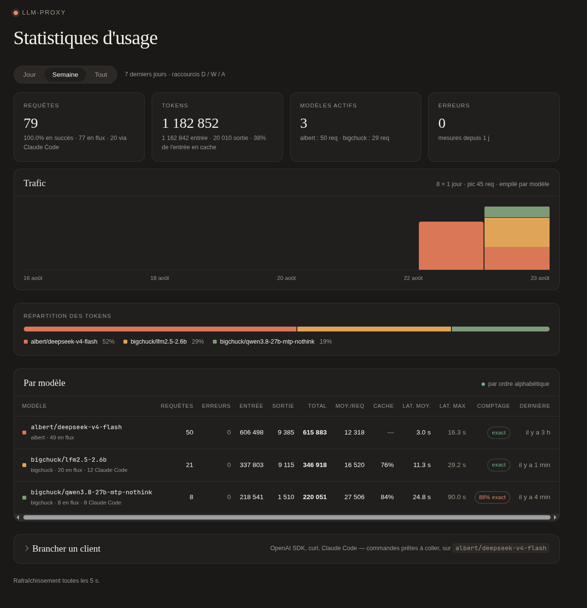

# llm-proxy

Passerelle LLM qui met **plusieurs backends derrière un seul endpoint** et
laisse **chaque client parler sa propre API**. Les backends sont des
serveurs compatibles OpenAI : machines locales (llama.cpp, gufo), service
hébergé à quotas (Albert, de la DINUM), ou tout autre. Le client vise une
seule URL et choisit le backend par le **préfixe du nom de modèle**
(`bigchuck/qwen3.8-flash-next`, `albert/deepseek-v4-flash`).

Trois API côté client, une seule côté backend (`/v1/chat/completions`) :

- **OpenAI** (pi, omp, Hermes, tout SDK OpenAI) : relayée telle quelle.
- **Anthropic Messages** (Claude Code) : traduite.
- **OpenAI Responses** (Codex CLI) : traduite.

Autour du relais : un catalogue `/v1/models` unifié, des **outils web
hébergés** (recherche par une instance SearXNG, lecture de page) que le
proxy exécute pour le modèle, un limiteur de quotas pour les backends qui
en ont, des statistiques persistantes à la forme de l'Usage API d'OpenAI
et un tableau de bord.



## Fonctionnalités

- **Configuration en un seul fichier** — tout vit dans
  `data/config.toml` (voir [Configuration](#configuration)). L'environnement
  ne sert plus qu'aux **secrets**, injectés dans le TOML par `${VAR}`.
- **Routage multi-backends** — une table `[backends.<nom>]` par backend ;
  le nom est le discriminant de routage, retiré avant transfert
  (llama.cpp reçoit `qwen3-32b`, pas `bigchuck/qwen3-32b`).
- **Catalogue unifié** — `GET /v1/models` interroge tous les backends en
  direct, préfixe les ids et **normalise les entrées sur un schéma
  uniforme** (type, coûts, `max_context_length` dérivé du `--ctx-size`
  ou du `n_ctx_train` côté llama.cpp) ; les détails internes (chemins
  `.gguf`, args…) ne sont jamais publiés. Les noms renvoyés sont
  directement routables.
- **Limiteur de quotas** — pour un backend à quotas (`quotas = true` ;
  aujourd'hui Albert, dont le limiteur connaît le compte) : temporise les
  requêtes pour rester
  sous les limites du compte (fenêtres minute **et** jour, chargées via
  `/v1/me/info`, rafraîchies périodiquement). Retarde plutôt que
  rejeter ; si l'attente dépasse `quotas.max_queue_seconds` (quota journalier
  épuisé) → 429 local avec `Retry-After`. Un client qui raccroche pendant
  l'attente quitte la file sans rien consommer (compté `499`) : un SDK qui
  retente sur timeout n'empile pas de doublons facturés. Plusieurs backends
  à quotas possibles (deux comptes Albert = deux jeux de limiteurs
  indépendants).
- **Backends locaux à la demande** — jamais sondés en tâche de fond
  (souvent éteints) : connexion coupée à 1 s, backend éteint → 503
  `backend_offline` avec `Retry-After`, et simplement absent de
  `/v1/models`.
- **Clés centralisées** — la clé d'un backend (`api_key`) ne vit que
  dans le proxy ; l'`Authorization` du client est remplacé. Les clients n'ont rien à
  configurer (une valeur bidon suffit si leur SDK exige une clé).
- **Correctif `tool_choice`** — quand `tools` est présent sans
  `tool_choice`, le proxy peut injecter `tool_choice: "auto"` (le schéma
  d'Albert déclare `"default": "none"`, ce qui casse le tool calling des
  agents). **Rien n'est injecté par défaut** : le correctif s'active
  backend par backend (`force_tool_choice`), là où il est nécessaire. Un
  `tool_choice` explicite du client n'est jamais écrasé.
- **Surface minimale** — seuls `POST /v1/chat/completions`,
  `GET /v1/models` et les chemins de `FORWARD_POST_PATHS` sont relayés ;
  toute autre URL → 404 local `unknown_route`. Le streaming SSE passe
  intact.
- **Audio et images** — synthèse (`/v1/audio/speech`), transcription,
  génération et édition d'image passent par le même routage au préfixe
  de modèle. Les corps multipart (transcription, édition) sont routés
  d'après leur champ `model`, préfixe retiré, le reste recopié octet pour
  octet (`llm_proxy/multipart.py`) ; sans cela ils partaient vers le
  backend de repli. `GET /v1/audio/voices?model=<backend>/<modèle>` liste
  les voix du modèle de synthèse.
- **Compatible Claude Code** — si `[anthropic].enabled`, le proxy parle
  aussi l'**API Messages d'Anthropic** : `POST /v1/messages` (JSON et
  flux SSE, outils compris), `/v1/messages/count_tokens`, et
  `GET /v1/models` à la forme Anthropic. Traduit vers
  `/v1/chat/completions` du backend visé — **uniquement dans ce sens**,
  aucun backend Anthropic. Voir [Claude Code](#claude-code).
- **Compatible Codex CLI** — si `[responses].enabled`, le proxy parle
  aussi l'**API Responses d'OpenAI** : `POST /v1/responses` (JSON et
  flux d'événements `response.*`, outils compris), traduit vers
  `/v1/chat/completions` du backend visé — aucun backend n'a besoin de
  servir `/v1/responses`. Voir [Codex CLI](#codex-cli).
- **Outils hébergés** — si `[tools.web_search].enabled`, le `web_search`
  que déclare un client Responses n'est plus ignoré : le proxy
  l'**exécute lui-même** (recherche par une instance SearXNG livrée dans
  le `docker-compose.yml`, lecture de pages par `web_fetch`), relance le
  backend avec le résultat et rend au client des éléments
  `web_search_call`. Même service pour l'outil serveur
  `web_search_20250305` d'un client Anthropic — celui par lequel passe
  le `WebSearch` de Claude Code —, rendu en blocs `server_tool_use` /
  `web_search_tool_result`, et pour son outil serveur
  `web_fetch_20250910` (blocs `web_fetch_tool_result`). Si `[chat].hosted_tools`, un client
  `/v1/chat/completions` peut déclarer ces mêmes outils dans `tools`
  (`{"type": "web_search"}`) et reçoit une réponse ordinaire, la boucle
  faite. Voir [Outils hébergés](#outils-hébergés).
- **Plafond `max_tokens`** — optionnel, par backend : la valeur du
  client est ramenée au plafond (Claude Code en demande 32 000).
- **Observabilité** — `GET /healthz` expose l'état de chaque backend
  (URL, quotas restants par fenêtre, derniers modèles vus, réglages
  `tool_choice` / `max_tokens` / `images` / `tokenize_path`) et de la
  surface Anthropic ; un résumé périodique des compteurs est loggé
  (`quotas.status_interval`), et toute erreur upstream (4xx/5xx) l'est
  avec le début de son corps — le client, lui, ne voit souvent qu'un
  statut.
- **Statistiques persistantes, à la forme d'OpenAI** —
  `GET /v1/organization/usage/completions` : **l'Usage API d'OpenAI**,
  servie depuis les compteurs du proxy. Une ligne SQLite par requête
  (`data/stats.db`), donc les chiffres survivent au redémarrage et toute
  fenêtre temporelle est calculable après coup. C'est la **seule**
  lecture des statistiques — il n'existe pas de format privé, et le
  SDK OpenAI officiel s'y branche tel quel (voir
  [Statistiques](#statistiques-usage-api)). Les exécutions d'outils
  hébergés ont une route sœur de même forme,
  `GET /v1/organization/usage/tools`.
- **Tableau de bord** — `GET /ui` (ou `/`) : une page Vue 3 qui consomme
  cette même Usage API, en vues **Jour / Semaine / Tout**, outils
  hébergés compris (voir [Tableau de bord](#tableau-de-bord)).

## Fichiers

| Fichier | Rôle |
|---|---|
| `main.py` | Point d'entrée (`uvicorn main:app`) — trois lignes, tout le code est dans le paquet |
| `llm_proxy/config.py` | Chargement de `data/config.toml` : substitution des `${VAR}`, accès typés, création du fichier depuis l'exemple au premier démarrage |
| `llm_proxy/settings.py` | La table `[proxy]`, en constantes typées |
| `llm_proxy/backends.py` | Déclaration des backends, clients HTTP, **routage au préfixe de modèle** |
| `llm_proxy/albert.py` | Tout ce qui est spécifique à Albert : limiteur de quotas (fenêtres minute/jour), familles de modèles, association routeurs ↔ modèles via `/v1/me/info` |
| `llm_proxy/stats.py` | Compteurs persistés en SQLite (une ligne par requête, une par exécution d'outil hébergé), extraction de l'`usage` dans le flux de réponse, et l'Usage API (requêtes, outils) |
| `llm_proxy/anthropic_api.py` | La surface Anthropic : traduction Messages ↔ chat/completions, flux SSE compris ; `model_map` ; outils serveur `web_search_…` et `web_fetch_…` remplacés par la recherche et la lecture hébergées, rendues et rejouées en blocs `server_tool_use` / `web_search_tool_result` / `web_fetch_tool_result` |
| `llm_proxy/responses_api.py` | La surface Responses : traduction Responses ↔ chat/completions, flux d'événements compris ; outils hébergés par le proxy présentés au modèle et rejoués, les autres ignorés, `namespace` aplatis |
| `llm_proxy/chat_api.py` | Les outils hébergés sur `/v1/chat/completions` : déclaration dans `tools` remplacée par les fonctions du proxy, robinet qui rend une seule réponse chat/completions pour plusieurs tours upstream |
| `llm_proxy/tools/__init__.py` | Les outils hébergés, ce qui leur est commun : registre, exécution bornée (délai, taille du résultat, nombre d'appels par réponse), ligne de statistiques de chaque exécution, **mémoire des résultats** |
| `llm_proxy/tools/net.py` | Garde-fou réseau : résolution du nom par le proxy, adresses **publiques** seulement, connexion vers l'adresse vérifiée |
| `llm_proxy/tools/webcache.py` | Cache web : pages lues et recherches gardées quelques minutes, borné, en mémoire vive |
| `llm_proxy/tools/html_text.py` | HTML → texte lisible par un modèle, bibliothèque standard seule (titres, paragraphes, listes, liens, blocs de code) |
| `llm_proxy/tools/web_search.py` | L'outil `web_search` : requête JSON à SearXNG, résultats numérotés (titre, date, URL, extrait) — en texte pour le modèle, en liste structurée pour les blocs d'un client Anthropic ; filtre par domaines |
| `llm_proxy/tools/web_fetch.py` | L'outil `web_fetch` : lecture d'une page (ou du texte d'un PDF) par son URL, redirections suivies saut par saut sous le garde-fou, tailles bornées |
| `llm_proxy/multipart.py` | Le champ `model` d'un corps multipart/form-data : lu pour router, réécrit pour retirer le préfixe |
| `llm_proxy/app.py` | L'application FastAPI : routes, auth, relais, `/v1/models` fusionné |
| `tests/` | Tests des traducteurs et des stats (`pytest`, `requirements-dev.txt`) — sur des octets et une base temporaire, sans réseau |
| `envTest/` | Validation avec de **vrais clients** en conteneurs jetables : Claude Code, pi et Codex CLI, scénarios PASS/FAIL — voir `envTest/README.md` |
| `llm_proxy/web/` | Le tableau de bord : `templates/index.html` (le gabarit Vue, servi tel quel) et `static/` (`dashboard.js`, `dashboard.css`, `vue.global.prod.js`) |
| `data/config.example.toml` | Le modèle de configuration, documenté — copié en `data/config.toml` au premier démarrage |
| `searxng/settings.yml` | Réglages de l'instance SearXNG du compose : les défauts de SearXNG, plus le format JSON. Monté en lecture seule dans le service `searxng` |

`app.py` ne connaît d'Albert que « un backend `quotas = true` passe par
sa `QuotaState` » ; toute la mécanique de quotas vit dans `albert.py`.

Chaque requête relayée est portée par un objet `Call` (backend, modèle
demandé, endpoint, dialecte du client) : c'est lui qui écrit la ligne de
stats — une fois, quel que soit le chemin de sortie — et construit les
erreurs à la forme attendue (`{"error": {…}}` ou, pour un client
Anthropic, `{"type": "error", …}`). La porte de quota (`gate`) et le
relais (`forward`) sont communs à toutes les routes ; `forward` fait
passer les octets upstream par un « robinet » — `stats.UsageCollector`
(identité, lit l'`usage` au passage), `anthropic_api.Translator` ou
`responses_api.Translator` (réécrivent la réponse). Ces deux-là portent
aussi les outils hébergés, par un même contrat (`pending`, `resolve`,
`next_turn`, `finalize`, `fail`) : une seule boucle, `hosted_loop`,
exécute les appels et relance le backend pour les deux surfaces.

`data/` est le seul dossier écrit à l'exécution (`config.toml`,
`stats.db`) : c'est le volume à monter.

## Statistiques (Usage API)

Les compteurs sont **persistés** : une ligne SQLite par requête servie
(`data/stats.db`), écrite hors de la boucle d'événements par un thread
dédié. Ils survivent donc au redémarrage, et n'importe quelle fenêtre
temporelle se calcule après coup. Purge automatique au-delà de
`stats.retention_days` (90 jours par défaut, `0` = illimité).

La seule route de lecture des requêtes est **l'Usage API d'OpenAI**
(les outils hébergés ont la leur, de même forme : voir
[Usage des outils hébergés](#usage-des-outils-hébergés)) :

    GET /v1/organization/usage/completions
        ?start_time=<epoch>        (obligatoire)
        &end_time=<epoch>
        &bucket_width=1m|1h|1d|all
        &group_by[]=model
        &models[]=albert/openweight-large
        &limit=<n>&page=<curseur>

Réponse : `page` → `bucket` → `result`, au schéma OpenAI exact. Le SDK
officiel s'y branche sans adaptation :

```python
from openai import OpenAI
c = OpenAI(base_url="http://localhost:8000/v1", api_key="x", admin_api_key="x")
page = c.admin.organization.usage.completions(
    start_time=..., bucket_width="1d", group_by=["model"], limit=7)
```

Deux écarts, **tous deux additifs** — un SDK ignore ce qu'il ne connaît
pas, la compatibilité reste entière :

- `bucket_width=all` en plus de `1m`/`1h`/`1d` : un seul seau couvrant
  toute la plage, pour obtenir un total sans agréger soi-même ;
- `input_cached_tokens` est **renseigné** quand le backend dit ce qu'il a
  servi depuis son cache de préfixe (`prompt_tokens_details.cached_tokens`
  — llama.cpp, vLLM, OpenAI) ; `0` sinon, jamais une valeur inventée.
  Inclus dans `input_tokens`, comme chez OpenAI ;
- chaque `result` porte, en plus des champs du schéma, ce que le proxy
  sait mesurer et qu'OpenAI n'expose pas : `num_errors`,
  `num_streamed_requests`, `num_estimated_requests`,
  `num_anthropic_requests` (arrivées par `/v1/messages`, donc Claude
  Code), `total_latency_seconds`, `avg_latency_seconds`,
  `max_latency_seconds`, `first_request_time`, `last_request_time`.

**Toutes ces grandeurs s'agrègent sans perte** : elles s'additionnent
(requêtes, tokens, somme des latences) ou se maximisent (latence max).
Un client peut donc recomposer n'importe quelle période à partir de
seaux plus fins et retrouver *exactement* ce qu'aurait rendu un seau
unique — à condition d'aligner `start_time` sur la largeur des seaux,
puisqu'ils se calent sur des multiples depuis l'epoch. C'est ce qui
permet au tableau de bord de tout tirer d'un seul appel. Il n'y a
volontairement **pas de percentile** : un p95 n'a pas cette propriété,
il imposerait un appel séparé et une requête de tri par partition.

Le champ `model` est le nom **préfixé** (`albert/openweight-large`),
donc directement réutilisable comme `model` d'une requête. Les
dimensions que le proxy ne possède pas (`project_id`, `user_id`,
`api_key_id`, `batch`) valent `null` ; **filtrer** dessus rend une page
vide, plutôt que d'ignorer le filtre en silence et de sur-déclarer
l'usage.

Comptage des tokens : le bloc `usage` de l'upstream quand il existe —
streaming SSE compris —, sinon une estimation à ~4 caractères par
token. Les deux sont comptés séparément (`num_estimated_requests`) pour
que le chiffre affiché reste honnête. Une requête **en erreur** sans
`usage` (500 upstream, 429 local, client parti) compte **0 token,
exact** : rien n'a été consommé de mesurable, et le corps envoyé n'a pas
à gonfler l'entrée.

### Usage des outils hébergés

Chaque exécution d'un [outil hébergé](#outils-hébergés) laisse **une
ligne** dans la même base (table `tool_calls`), par le même thread
d'écriture et sous la même purge `stats.retention_days`. Elle est écrite
au point unique par où passent les trois chemins (`tools.Hosted.run`) :
la boucle de `/v1/responses`, celle de `/v1/messages`, l'appel direct
`POST /v1/tools/<nom>`. Une base existante reçoit la table au démarrage,
rien n'est à migrer à la main. La table `requests` n'en est pas changée :
une réponse qui a utilisé des outils y garde **une** ligne, avec son
usage de tokens cumulé.

Par exécution : l'horodatage, l'outil, la route d'appel, le modèle
préfixé de la conversation (aucun pour l'appel direct), l'issue, la
durée, le nombre de caractères rendus au modèle. **Rien du contenu** :
ni la requête de recherche, ni l'URL lue, ni les arguments, ni le
résultat. Le journal applicatif les montre (160 caractères d'arguments,
200 d'une erreur) ; les statistiques, elles, ne gardent rien de ce que
les utilisateurs cherchent ou lisent.

Trois issues :

| Issue | Sens |
|---|---|
| `ok` | l'outil a rendu son résultat |
| `error` | le résultat rendu au modèle commence par `Error:` — moteur injoignable, page en 404, délai dépassé, adresse refusée, arguments illisibles (`num_errors`) |
| `limit` | refus par limite d'appels (`max_calls`, `max_uses` du client, limite propre à l'outil) : **rien n'a été exécuté**, durée nulle (`num_limited`) |

Lecture :

    GET /v1/organization/usage/tools
        ?start_time=<epoch>        (obligatoire)
        &end_time=<epoch>
        &bucket_width=1m|1h|1d|all
        &group_by[]=tool&group_by[]=endpoint&group_by[]=model
        &models[]=bigchuck/qwen3.8-flash-next
        &limit=<n>&page=<curseur>

```json
{"object": "page", "has_more": false, "next_page": null, "data": [
  {"object": "bucket", "start_time": 1791158400, "end_time": 1791244800,
   "results": [
    {"object": "organization.usage.tools.result", "num_requests": 4,
     "project_id": null, "user_id": null, "api_key_id": null,
     "model": null, "tool": "web_search", "endpoint": null,
     "num_errors": 1, "num_limited": 1,
     "total_duration_seconds": 22.0, "avg_duration_seconds": 7.333,
     "max_duration_seconds": 20.0, "result_chars": 9438,
     "first_request_time": 1791220947, "last_request_time": 1791220990}]}]}
```

**Ce qui est la forme d'OpenAI, ce qui est du proxy.** L'Usage API
d'OpenAI a une route par nature d'usage (`completions`, `embeddings`,
`images`, `web_search_calls`, `file_search_calls`,
`code_interpreter_sessions`…), toutes de la même forme. Relu le
05/10/2026 dans les types du SDK `openai-python`
(`types/admin/organization/usage_*`), la page de référence d'OpenAI
refusant ce jour-là la lecture automatique :

- **repris tel quel** : la page (`object: "page"`, `data`, `has_more`,
  `next_page`), le seau (`object: "bucket"`, `start_time`, `end_time`,
  `results`), les paramètres `start_time`, `end_time`, `bucket_width`,
  `group_by`, `models`, `limit`, `page`, les filtres `project_ids` /
  `user_ids` / `api_key_ids`, les champs `project_id`, `user_id`,
  `api_key_id`, `model` du résultat, et `num_requests` pour le nombre
  d'appels (le nom qu'il porte dans les résultats `web_searches` et
  `file_searches` d'OpenAI). Validation, alignement des seaux et
  pagination sont ceux de `/completions`, par le même code ;
- **propre au proxy** : la route elle-même (`/usage/tools` n'existe pas
  chez OpenAI), le type `organization.usage.tools.result`, les
  dimensions `tool` et `endpoint` (dans `group_by` et dans le résultat),
  `num_errors`, `num_limited`, les trois durées, `result_chars`,
  `first_request_time` / `last_request_time`, et `bucket_width=all`
  comme pour `/completions`.

OpenAI a bien une route pour des appels d'outils,
`/v1/organization/usage/web_search_calls` : elle ne compte que des
recherches (`num_requests`, `num_model_requests`, par modèle et
`context_level`), sans issue ni durée, et rien n'y correspond à une
lecture de page. **Le proxy ne la sert pas** : une seule route couvre
tous ses outils.

`model` est `null` pour un appel direct (le proxy n'y voit pas de
modèle) ; `endpoint` vaut `/v1/responses`, `/v1/messages`,
`/v1/chat/completions` ou
`/v1/tools`. `avg_duration_seconds` porte sur les appels réellement
lancés (`num_requests - num_limited`). Comme pour les requêtes, tout
s'additionne ou se maximise : pas de percentile.

**Ce qui n'est pas mesuré** : le contenu, donc (ni ce qui est cherché,
ni ce qui est lu) ; les tokens que coûte un résultat d'outil (ils sont
dans la ligne de la requête, pas répartis par outil) ; le lien entre
une exécution et sa requête (aucun identifiant commun) ; le poids d'une
image générée (`result_chars` est le texte rendu au modèle, une
phrase) ; les appels aux outils **du client** (un `function_call` rendu
au client n'est pas exécuté par le proxy) ; une exécution interrompue
parce que le client a raccroché (elle ne laisse pas de ligne).

## Tableau de bord

`GET /ui` (ou `/`) — c'est la copie d'écran ci-dessus. La page est servie
telle quelle : le serveur ne calcule aucun balisage. Le gabarit est
**déclaratif, écrit dans le HTML**, et rendu par **Vue 3** — build complet
embarqué localement (`/ui/static/vue.global.prod.js`), donc **aucun CDN et
aucune étape de compilation**. `dashboard.js` ne contient que l'état et
les valeurs dérivées ; rien n'y touche au DOM.

Trois vues, sélecteur en haut de page :

| Vue | Période | Découpage | Raccourci |
|---|---|---|---|
| Jour | 24 dernières heures | 1 heure | <kbd>D</kbd> |
| Semaine | 7 derniers jours | 1 jour | <kbd>W</kbd> |
| Tout | depuis le plus ancien enregistrement | 1 heure ou 1 jour, selon l'étendue | <kbd>A</kbd> |

Et **deux lectures du même trafic**, second sélecteur juste à côté :
*Requêtes* (<kbd>R</kbd>) ou *Tokens* (<kbd>T</kbd>). C'est la mesure que
porte la courbe **Trafic** — hauteur des barres, partage entre modèles,
pic annoncé. Les deux grandeurs sont déjà dans la réponse : basculer ne
redemande rien au proxy, les mêmes barres glissent simplement vers leur
nouvelle hauteur.

Les deux choix sont mémorisés (`localStorage`). **Un seul appel par
rafraîchissement** pour le trafic : les seaux de la période, groupés par
modèle (un second, pour la section *Outils*, est décrit plus bas). Totaux,
ligne par modèle et courbe s'en déduisent, puisque tout ce qu'expose
l'API s'additionne ou se maximise. La borne de départ est alignée sur la
largeur des seaux, si bien que les chiffres du tableau portent exactement
sur ce que montre la courbe. Un second appel, léger, sert uniquement à
savoir jusqu'où remonte l'historique — au chargement et au changement de
période, jamais dans la boucle.

Rien n'est demandé tant que l'onglet est masqué ; au retour, la page se
rafraîchit immédiatement plutôt que d'afficher des chiffres périmés.

Le rafraîchissement de 5 s ne clignote pas : Vue rapproche les listes par
leur clé et ne réécrit que ce qui a changé, si bien que les nœuds
survivent d'un cycle à l'autre. Ils gardent donc leurs transitions en
cours, le survol et la sélection de texte — et les barres **glissent**
vers leur nouvelle hauteur au lieu d'y sauter.

Au changement de période, en revanche, le découpage change : les barres ne
représentent plus les mêmes seaux, les faire glisser d'une valeur à
l'autre n'aurait pas de sens. Elles remontent donc de zéro, en cascade
(`@keyframes` armés par la classe `entering`, posée pour la seule durée de
l'animation). La barre de répartition, elle, garde ses segments et glisse
— rien à l'ouverture de la page, une barre qui se remplit au chargement se
remarque pour rien.

La courbe **Trafic** ne porte **qu'une mesure à la fois** — requêtes *ou*
tokens, au choix du sélecteur —, donc un seul axe, jamais deux échelles
superposées ; chaque barre est **empilée par modèle**, aux couleurs de la
répartition, le même modèle toujours au même étage d'un seau à l'autre.
L'autre grandeur et le détail par modèle sont dans l'infobulle, en CSS
pur.
Les seaux vides sont dessinés eux aussi : un creux doit se voir comme un
creux.

La section **Outils**, sous le tableau des modèles, montre les
[outils hébergés](#outils-hébergés) sur la même période : par outil, le
nombre d'appels, les erreurs, les refus par limite d'appels, la durée
moyenne et maximale d'une exécution, le volume rendu au modèle (en
caractères), le dernier appel, et sous son nom la répartition par route
d'appel (`/v1/responses : 12 · /v1/tools : 3`). Elle se lit par un second
appel à chaque rafraîchissement — **un seul seau** sur la période,
groupé par outil et par route, la section ne montrant que des totaux —
et **n'apparaît pas** quand aucun outil n'a servi dans la fenêtre. En
vue *Tout* elle part du début de la base, pas de la première requête :
un outil appelé directement peut la précéder.

Les chiffres sont lus sur `/ui/usage`, qui est la même route que
`/v1/organization/usage/completions` (et `/ui/usage/tools`, la même que
`/v1/organization/usage/tools`). Ce doublon n'existe que pour l'auth :
un `fetch` de navigateur ne peut pas porter l'en-tête `Authorization`,
alors que le cookie posé par `/ui` vaut pour tout ce qui est sous `/ui` —
et pour rien d'autre, si bien qu'il ne peut jamais servir à dépenser des
tokens. Si `proxy.api_keys` est renseigné, ouvrir `/ui?key=<clé>` une
fois : la clé est ensuite mémorisée dans un cookie `HttpOnly`.

Le badge **exact / estimé** de la colonne *Comptage* dit d'où viennent les
tokens : le bloc `usage` de l'upstream, ou l'estimation de repli
(streaming sans `stream_options.include_usage`).

La carte *Requêtes* et la ligne de chaque modèle comptent celles
arrivées par `/v1/messages` (Claude Code).

La colonne **Cache** dit quelle part de l'entrée le backend a servie
depuis son cache de préfixe, quand il le remonte (llama.cpp, vLLM) ;
`—` sinon (Albert). C'est la réponse à « le cache marche-t-il ? » : avec
Claude Code, un second tour qui rejoue les ~20 k tokens du prompt
système doit approcher 100 %.

En bas de page, le panneau repliable **Brancher un client** donne des
commandes prêtes à coller — catalogue, `curl`, SDK OpenAI, Claude Code
(avec l'état actif / inactif de la surface Anthropic) — dérivées de
l'URL de la page, de l'auth et des modèles connus (`/healthz`, lu une
fois, jamais dans la boucle) et du modèle le plus actif de la période.

## Claude Code

Avec `[anthropic].enabled = true` dans `config.toml`, Claude Code (ou
tout SDK Anthropic) se branche sur le proxy sans rien d'autre :

    export ANTHROPIC_BASE_URL=http://localhost:8000
    export ANTHROPIC_API_KEY=<clé de proxy.api_keys, ou n'importe quoi si ouvert>
    export ANTHROPIC_MODEL=albert/deepseek-v4-flash
    # tâches d'arrière-plan (titres, résumés…) sur un backend local :
    # export ANTHROPIC_SMALL_FAST_MODEL=bigchuck/qwen3-8b
    claude

Dans `~/.claude/settings.json`, `{"env": {"CLAUDE_CODE_ATTRIBUTION_HEADER":
"0"}}` retire l'attribution que Claude Code ajoute à ses requêtes —
variable d'une fois à l'autre, elle décale le préfixe et fait manquer le
cache du backend (colonne *Cache* du tableau de bord pour le vérifier).

Validé avec un vrai Claude Code et avec pi, en conteneurs, sur des
scénarios d'outils et de création de code — voir `envTest/`.

Ce qui se passe :

- `POST /v1/messages` est traduit en `/v1/chat/completions`, la réponse
  retraduite : objet `Message`, ou suite d'événements SSE
  (`message_start` → blocs → `message_delta` → `message_stop`), outils
  fragmentés compris. En flux, `stream_options.include_usage` est
  demandé : les stats sont **exactes**.

  | Côté Anthropic | Côté OpenAI |
  |---|---|
  | `system` (chaîne ou blocs) | message `system` en tête |
  | `system` **en cours** de conversation (rappels de Claude Code) | fondu en tête du message `user` suivant — les gabarits Qwen / Mistral refusent un `system` ailleurs qu'en tête (500) |
  | bloc `text` | texte |
  | bloc `image` | `image_url` (data URI) si le backend a `images = true` **et** que le modèle est multimodal à son catalogue ; sinon `[image ignorée : image/png, 12 Ko]` |
  | bloc `document` | le texte s'il en est ; un PDF → `[document ignoré : …]` |
  | `tool_use` (assistant) | `tool_calls[]`, arguments sérialisés |
  | `tool_result` (user) | un message `tool` **par résultat**, placés avant le reste du message ; une image dans le résultat suit dans un message `user` |
  | `thinking` / `redacted_thinking` | jetés (aucun backend ne les rejoue) |
  | `tools[{name, input_schema}]` | `tools[{type: function, …parameters}]` |
  | outil serveur `web_search_…` (`{"type": "web_search_20250305", "name": "web_search"}`) | la fonction `web_search` du proxy, exécutée par lui, si `[tools.web_search].enabled` — voir [Outils hébergés](#claude-code-et-loutil-serveur-web_search) ; ignoré sinon |
  | outil serveur `web_fetch_…` (`{"type": "web_fetch_20250910", "name": "web_fetch"}`) | la fonction `web_fetch` du proxy, exécutée par lui, si `[tools.web_fetch].enabled` — voir [L'outil serveur `web_fetch`](#loutil-serveur-web_fetch) ; ignoré sinon |
  | autres outils serveur (`code_execution_…`, `bash`…) | ignorés |
  | blocs `server_tool_use` + `web_search_tool_result` / `web_fetch_tool_result` rejoués (assistant) | un appel `web_search` / `web_fetch` et son message `tool`, si la requête déclare encore l'outil ; ignorés sinon |
  | `tool_choice` `auto` / `any` / `tool` / `none`, `disable_parallel_tool_use` | `auto` / `required` / `{function}` / `none`, `parallel_tool_calls: false` |
  | `stop_sequences`, `metadata.user_id`, `temperature`, `top_p`, `max_tokens` | `stop`, `user`, idem (plafond `max_tokens` du backend appliqué) |
  | `top_k`, `cache_control`, `thinking`, `output_config`, `context_management`, paramètres d'URL (`?beta=true`) | ignorés |
  | `finish_reason` `stop` / `length` / `tool_calls` | `stop_reason` `end_turn` / `max_tokens` / `tool_use` |
  | `reasoning_content` du backend | bloc `thinking` (`reasoning_as_thinking`) |
  | erreur OpenAI `{"error": {…}}` | `{"type": "error", "error": {type, message}}`, type déduit du statut |
- **Le modèle passe par `[anthropic.model_map]`**. Claude Code envoie
  des noms Claude en dur pour ses tâches d'arrière-plan (titres,
  résumés…), même avec `ANTHROPIC_MODEL` défini : la table les traduit en
  noms préfixés, routés comme d'habitude. Un suffixe `[1m]` est ignoré ;
  un nom déjà préfixé passe tel quel ; `default` attrape le reste ; sans
  correspondance → 400. L'exemple livre tous les noms connus sur
  `albert/deepseek-v4-flash`.
- `POST /v1/messages/count_tokens` : **exact** si le backend visé a un
  `tokenize_path` (llama.cpp : `/tokenize`), sinon estimation locale
  (~4 caractères par token, comme le limiteur). Claude Code s'en sert
  pour sa jauge de contexte et le moment de son `/compact`.
- Images : «multimodal au catalogue» = type `image-text-to-text`, que
  le proxy dérive d'`architecture.input_modalities` chez llama.cpp —
  présent seulement si le modèle est chargé avec son `--mmproj`. Le
  catalogue est chargé à la demande à la première image.
- `GET /v1/models` : le même catalogue, à la forme Anthropic, quand la
  requête porte `anthropic-version` (le SDK Anthropic le pose toujours,
  le SDK OpenAI jamais).
- L'auth du proxy accepte `x-api-key` en plus de `Authorization: Bearer`
  ; les en-têtes `x-api-key`, `anthropic-version`, `anthropic-beta` ne
  sont jamais relayés. Toutes les erreurs (401, 400, 429 du limiteur,
  503 backend éteint…) sortent à la forme Anthropic.
- Le limiteur, les stats (`endpoint = /v1/messages`), `force_tool_choice`
  et `max_tokens` s'appliquent comme pour tout autre client. En flux,
  derrière un backend à quotas, le `200` part **tout de suite** et des
  `event: ping` (toutes les `ping_interval` s) tiennent la connexion
  pendant l'attente du limiteur — Claude Code coupe un flux muet. Un 429
  local devient alors un `event: error` (`rate_limit_error`) dans le
  flux ; un client qui raccroche pendant l'attente quitte la file sans
  consommer de quota (499), comme ailleurs.

- **`WebSearch`** : l'outil de Claude Code ne cherche pas lui-même, il
  compte sur l'outil serveur `web_search` d'Anthropic. Sans recherche
  hébergée, cet outil est ignoré : le modèle répond sans chercher et
  `WebSearch` ne rend aucun lien. Avec `[tools.web_search].enabled`, le
  proxy fait la recherche — voir
  [Claude Code et l'outil serveur `web_search`](#claude-code-et-loutil-serveur-web_search).
  `WebFetch`, lui, lit les pages depuis le poste du client : le proxy
  n'y est pour rien (l'outil serveur `web_fetch` d'Anthropic, que Claude
  Code ne déclare pas, est branché pour les clients qui le déclarent —
  voir [L'outil serveur `web_fetch`](#loutil-serveur-web_fetch)).

À savoir : le prompt système de Claude Code pèse plusieurs milliers de
tokens, renvoyés à chaque tour sans cache exploitable côté OpenAI — le
quota journalier Albert se consomme vite ; `ANTHROPIC_SMALL_FAST_MODEL`
vers un backend local soulage (les tâches d'arrière-plan sont
nombreuses). Hors périmètre : Batches, Files, les outils serveur autres
que la recherche et la lecture de page (`code_execution`…), PDF.

## Codex CLI

Avec `[responses].enabled = true` dans `config.toml`, Codex CLI (ou tout
client de l'API Responses d'OpenAI) se branche sur le proxy par un
provider, dans `~/.codex/config.toml` :

    model = "bigchuck/qwen3.8-flash-next"
    model_provider = "llm-proxy"

    [model_providers.llm-proxy]
    name = "llm-proxy"
    base_url = "http://localhost:8000/v1"
    wire_api = "responses"
    # env_key = "LLM_PROXY_KEY"   # si proxy.api_keys est renseigné

Le modèle porte le **préfixe du backend**, comme pour un client OpenAI :
pas de table de correspondance. `POST /v1/responses` est traduit en
`/v1/chat/completions` — tous les backends le parlent, aucun n'a besoin
de servir `/v1/responses` — et la réponse retraduite, en objet
`response` ou en flux d'événements `response.*`.

Ce que le proxy fait de la requête, écrit sur les corps que Codex envoie
réellement (la tolérance reprend celle de gufo, gufo-org/gufo#434) :

- **Outils hébergés : `web_search` exécuté par le proxy s'il est activé,
  les autres ignorés**. `file_search`, `code_interpreter`, `mcp`,
  `image_generation`… ne peuvent être exécutés que par OpenAI : ils sont
  retirés, les outils `function` restent, et une ligne de log dit
  lesquels (`responses : file_search sans équivalent chat, ignoré(s)`).
  `web_search` subit le même sort tant que `[tools.web_search]` et
  `[tools.web_fetch]` sont inactifs ; activés, le proxy présente au
  modèle ses propres fonctions à la place et les exécute — voir
  [Outils hébergés](#outils-hébergés).
- **`custom` et `local_shell` présentés en fonctions** : ce sont des
  outils que le *client* exécute, sous une forme que chat/completions n'a
  pas. Un outil `custom` (« freeform » : son entrée est un texte libre,
  pas du JSON — Codex s'en sert pour `apply_patch`, avec une grammaire
  lark) devient une fonction à un seul champ `input` ; sa description est
  reprise, suivie d'une consigne (« passer le texte dans `input` ») et de
  la grammaire, qui n'est **pas** imposée au décodage. L'appel du modèle
  est rendu au client en `custom_tool_call` (`call_id`, `name`, `input`
  texte), en JSON comme en flux (`response.custom_tool_call_input.delta`
  puis `.done` : un seul delta, l'entrée entière, une fois les arguments
  du modèle complets). `local_shell` devient une fonction `local_shell`
  (`command` en tableau d'arguments, `working_directory`, `timeout_ms`,
  `env`), rendue en `local_shell_call` avec son action `exec`. Au tour
  suivant, l'appel et sa sortie (`custom_tool_call_output`,
  `local_shell_call_output` ou `function_call_output`) redeviennent appel
  assistant et message `tool`. Si une fonction du client porte déjà le
  nom, c'est elle qui le garde : l'outil est présenté suffixé
  (`apply_patch_2`) et son appel revient sous son vrai nom. Des arguments
  mal écrits ne cassent rien : un `custom` rend le texte reçu tel quel,
  un `local_shell` sans commande exploitable est rendu `incomplete`.
  Écrit d'après le code de Codex `rust-v0.157.1` et le SDK d'OpenAI.
  `custom` a été joué le 05/10/2026 avec Codex 0.157.1 en conteneur et un
  catalogue de modèles déclarant `apply_patch` en texte libre : le fichier
  demandé a été écrit. `local_shell` n'a été joué avec aucun client (Codex
  ne le déclare plus) — voir plus bas quand Codex envoie ces outils.
- **`namespace` aplatis** : un `namespace` groupe des fonctions exécutées
  par le client (les `multi_agent_v1` de Codex). Ses fonctions rejoignent
  la liste, appelées par leur nom simple ; le `namespace` d'origine est
  reposé sur l'appel rendu au client. Un nom présent deux fois → `400`.
  Un outil `custom` peut s'y trouver aussi (Codex l'y range pour les
  modèles en mode « responses lite »).
- **Champs sans effet tolérés** : `include`, `reasoning.summary`,
  `text.verbosity`, `prompt_cache_key`, `client_metadata`, `store`… Le
  corps upstream est reconstruit, rien d'inconnu ne part vers le backend.
- **Consignes d'ouverture en un seul `system`** : `instructions` et les
  messages `developer` qui ouvrent la conversation sont réunis dans le
  message system de tête (beaucoup de gabarits n'en acceptent qu'un). Le
  préfixe reste identique d'un tour à l'autre : sur une session Codex
  réelle vers gufo, 99 % du prompt est repris du cache dès le troisième
  tour (colonne *Cache* du tableau de bord).
- **`reasoning`** : les éléments rejoués sont jetés ; à l'inverse, le
  `reasoning_content` d'un backend devient un élément `reasoning`
  (résumé) visible dans le client (`reasoning_as_summary`).
  `reasoning.effort` part en `reasoning_effort`.
- **Aucun état de conversation** : `previous_response_id`,
  `conversation`, `background` et `item_reference` → `400` explicite.
  Codex renvoie tout l'historique à chaque tour. Seule exception, et
  seulement si les outils hébergés sont activés : la
  [mémoire des résultats](#mémoire-des-résultats) de leurs appels.

Les statistiques comptent ces requêtes sous `/v1/responses`, avec
l'`usage` exact du backend.

**Quand Codex envoie-t-il `custom` ou `local_shell` ?** Par défaut,
jamais à ce proxy : la capture d'une session Codex 0.157.1 n'y montre que
des `function`, un `namespace` et `web_search`. D'après son code
(`rust-v0.157.1`) :

- `custom` n'est déclaré que pour `apply_patch`, et seulement si les
  métadonnées du modèle portent `apply_patch_tool_type = "freeform"`
  (`core/src/tools/spec_plan.rs`). Un modèle inconnu de son catalogue
  reçoit des métadonnées de repli sans ce champ
  (`models-manager/src/model_info.rs`) — c'est le cas de
  `bigchuck/qwen3.8-flash-next`, qui édite alors ses fichiers par
  `exec_command`. Deux façons de l'obtenir : `model_catalog_json =
  "/chemin/catalogue.json"` dans `~/.codex/config.toml`, un catalogue
  (`{"models": [...]}`, au moins une entrée, mêmes champs que le
  `models.json` embarqué de Codex) qui décrit le modèle avec ce champ ;
  ou, par accident, un modèle dont le nom **après le préfixe du backend**
  commence par celui d'un modèle du catalogue embarqué (`gpt-5.5…`,
  `gpt-5.4…`) — la correspondance se fait au plus long préfixe, un
  premier segment `backend/` retiré — et qui hérite alors de TOUTES ses
  métadonnées, consignes système comprises.
- `local_shell` n'est plus déclaré du tout : le `ToolSpec` de cette
  version n'en a plus la variante, et un `local_shell_call` reçu n'y est
  pas exécuté (`core/src/tools/router.rs`). La traduction ne sert qu'à un
  autre client de l'API Responses ; la documentation d'OpenAI annonce
  elle-même la fin de cet outil, avec `codex-mini-latest`, au 12/02/2026.

Est-ce que ça vaut le coup ? `apply_patch` en fonction donne au modèle un
outil d'édition dédié au lieu de `exec_command` ; rien ne dit qu'un
modèle local écrit mieux un patch dans une chaîne JSON qu'un `cat <<EOF`,
et ce n'est pas mesuré.

## Outils hébergés

Un client de l'API Responses déclare des outils qu'il ne sait pas
exécuter lui-même : avec `{"type": "web_search"}`, Codex CLI compte
qu'OpenAI fera la recherche côté serveur. Derrière ce proxy il n'y a pas
d'OpenAI — sans rien faire, l'outil est retiré et le modèle n'a pas de
recherche web. Un outil **hébergé** est un outil que le proxy exécute
lui-même, à la place d'OpenAI. Il y en a deux, activés ensemble par le
`web_search` du client. Un client de l'API Messages d'Anthropic est dans
le même cas avec ses outils serveur `web_search_20250305` et
`web_fetch_20250910` ; pour lui, chaque fonction n'est présentée que si
son outil est déclaré — voir
[Claude Code et l'outil serveur `web_search`](#claude-code-et-loutil-serveur-web_search)
et [L'outil serveur `web_fetch`](#loutil-serveur-web_fetch).

| Fonction présentée au modèle | Ce qu'elle fait | Par quoi |
|---|---|---|
| `web_search` (`query`, `recency`, `limit`) | Une recherche ; rend une liste numérotée — titre, date, URL, extrait de 240 caractères | Une instance **SearXNG** auto-hébergée (métamoteur libre, API JSON, sans clé), `GET <searxng_url>/search?q=…&format=json` |
| `web_fetch` (`url`, `offset`) | Lit une page ; HTML converti en texte, JSON et texte tels quels, texte extrait d'un PDF (pas d'OCR : un scan est refusé, un PDF chiffré aussi), tout autre type refusé | Une requête HTTP du proxy, sous le garde-fou réseau |

Le schéma de `web_search` et la forme de sa sortie sont repris de l'outil
`web_search` d'[oh-my-pi](https://github.com/can1357/oh-my-pi).

État de la validation au 05/10/2026, sur un déploiement réel (image
SearXNG et `settings.yml` du dépôt), vers gufo 0.8.0
(`bigchuck/qwen3.8-flash-next`). Une même question de recherche a été
posée par les quatre clients, et chacun a répondu avec l'URL d'une source
trouvée par SearXNG :

| Client | Chemin | Ce qui a été joué |
|---|---|---|
| Codex CLI 0.157.1 | `/v1/responses`, boucle du proxy | recherche ; lecture de deux pages dans une même réponse ; adresse locale refusée par le garde-fou |
| Claude Code 2.1.287 | `/v1/messages`, outil serveur `web_search` | recherche par son outil `WebSearch` ; six recherches en erreur enchaînées (moteur éteint), blocs d'erreur lus par Claude Code |
| pi 0.87.1 | `/v1/tools`, extension `llm-proxy-web.ts` | recherche ; lecture de page ; commandes `/web` et `/page` |
| omp 18.3.2 | `/v1/tools`, extension `llm-proxy-web.ts` | recherche ; lecture de page ; commandes `/web` et `/page` |

Ce jour-là SearXNG rendait 20 résultats, deux de ses moteurs étant
refusés par leur source (Brave en limite de débit, DuckDuckGo en
CAPTCHA) : la qualité dépend des moteurs que l'adresse de la machine peut
encore joindre.

Un backend à quotas est passé dans la boucle ce jour-là
(`albert/deepseek-v4-flash-0731` : recherche puis réponse), sans attente
de quota provoquée.

Pas encore joué : une attente de quota à un tour ultérieur, un client qui
rejoue des blocs `web_search_tool_result` sur `/v1/messages` (Claude Code
ne le fait pas), le service `searxng` du `docker-compose.yml` du dépôt
tel quel (le déploiement d'essai l'intègre dans un compose local, sans la
clé obligatoire), et pi ou omp avec tous leurs outils (les essais
limitaient le modèle aux deux outils web).

Les bancs `envTest/` rejouent depuis ce jour une recherche web par client
en conteneur (Codex, pi, Claude Code) : 27 scénarios sur 27 au run du
05/10/2026, voir `envTest/README.md`.

### Déroulé

1. Le client déclare `web_search` dans `tools` (les variantes
   `web_search_preview` et `web_search_2025_08_26` comptent aussi). Rien
   n'est ajouté à une requête qui ne le déclare pas.
2. Le proxy présente au modèle, à la place, les fonctions `web_search` et
   `web_fetch` — celles qui sont activées. Une fonction du client qui
   porterait déjà l'un de ces noms garde le sien : l'outil hébergé
   homonyme n'est alors pas présenté.
3. Quand le modèle appelle l'une d'elles, l'appel n'est **pas** rendu au
   client en `function_call` : le proxy l'exécute, ajoute le résultat à
   la conversation et **relance le backend**, jusqu'à un tour sans appel
   hébergé. Un tour qui mêle appels hébergés et appels du client
   s'arrête après les premiers : la main revient au client.
4. Le client ne voit de tout cela que des éléments `web_search_call`
   terminés — action `search` (la requête) ou `open_page` (l'URL) —, puis
   la réponse.
5. Au tour suivant, le client renvoie ces éléments **sans leur résultat**
   (OpenAI le garde côté serveur). Le proxy le relit dans sa mémoire et
   l'élément redevient, à l'identique, un appel suivi de son résultat.

Une erreur d'outil n'est jamais une erreur HTTP : SearXNG injoignable,
page en 404, délai dépassé, adresse refusée — le modèle reçoit un texte
`Error: …` et s'adapte. Chaque exécution laisse une ligne de log
(`outil hébergé web_search(…) → N car. en 1.2s`).

Une réponse = **une** ligne de statistiques de requête, quel que soit le
nombre de tours upstream, avec l'usage cumulé ; chaque tour repasse par
le limiteur d'un backend à quotas. Chaque **exécution d'outil** a en plus
sa propre ligne — outil, route d'appel, modèle, issue, durée, taille du
résultat, **jamais le contenu** —, lue par
`GET /v1/organization/usage/tools` et la section *Outils* du tableau de
bord : voir [Usage des outils hébergés](#usage-des-outils-hébergés). Les
outils actifs sont dits au démarrage dans les logs et dans `/healthz`
(`tools` : fonctions actives, `max_calls`, nombre d'entrées en mémoire —
un état, pas des compteurs : l'usage se lit par l'Usage API).

### Claude Code et l'outil serveur `web_search`

L'outil `WebSearch` de Claude Code ne cherche pas lui-même. À chaque
appel il envoie une **sous-requête** `/v1/messages` à part — un court
`system`, un message « Perform a web search for the query: … », et pour
seul outil `{"type": "web_search_20250305", "name": "web_search",
"max_uses": 8}` — en comptant qu'Anthropic exécutera la recherche. Il lit
ensuite les blocs de la réponse. Avec `[tools.web_search].enabled`, le
proxy tient ce rôle :

1. L'outil serveur `web_search_…` (toute version datée) devient, pour le
   modèle, la fonction `web_search` du tableau ci-dessus. **`web_fetch`
   n'est pas présenté** à Claude Code, qui ne le déclare pas : sa lecture
   de page (`WebFetch`) se fait sur le poste du client — la description
   de `web_search` n'y renvoie donc pas. Une fonction du
   client nommée `web_search` garde son nom, l'outil hébergé n'est alors
   pas présenté. Les autres outils serveur restent ignorés, sauf
   [`web_fetch_…`](#loutil-serveur-web_fetch).
2. Quand le modèle l'appelle, le proxy exécute la recherche et relance
   le backend — la même boucle que pour Codex. Le modèle reçoit le même
   texte de résultats que sur la surface Responses.
3. Le client reçoit, en flux SSE comme en JSON, ce qu'Anthropic rend :

       content_block_start  {"index": 1, "content_block": {"type": "server_tool_use",
                             "id": "srvtoolu_…", "name": "web_search", "input": {}}}
       content_block_delta  {"index": 1, "delta": {"type": "input_json_delta",
                             "partial_json": "{\"query\": \"…\"}"}}
       content_block_stop   {"index": 1}
       ping …                                    (tant que la recherche dure)
       content_block_start  {"index": 2, "content_block": {"type": "web_search_tool_result",
                             "tool_use_id": "srvtoolu_…", "content": [
                               {"type": "web_search_result", "title": "…", "url": "…",
                                "encrypted_content": "<l'extrait>", "page_age": "2026-10-03"}]}}
       content_block_stop   {"index": 2}
       … le texte de la réponse …
       message_delta        {"delta": {"stop_reason": "end_turn"}, "usage": {…,
                             "server_tool_use": {"web_search_requests": 1}}}

   Chaque résultat suit son appel, même quand le modèle lance deux
   recherches d'un coup. L'`input` reprend les arguments du modèle
   (`query`, et `recency` / `limit` s'il les a donnés). Aucun résultat :
   `content` est une liste vide. Une recherche en échec n'est pas une
   erreur HTTP : `content` est l'objet `{"type":
   "web_search_tool_result_error", "error_code": …}` — `max_uses_exceeded`,
   `invalid_tool_input` (pas de `query`), `unavailable` pour tout le
   reste — et le modèle, lui, lit le texte `Error: …` complet.

Ce qui vient de l'outil du client :

- **`max_uses`** est respecté, sans jamais dépasser `[tools].max_calls`.
  Il vaut pour SON outil : recherche et lecture déclarées ensemble ont
  chacune leur compte, et `max_calls` borne leur total.
- **`allowed_domains` / `blocked_domains`** filtrent les résultats avant
  la limite, aux règles d'Anthropic : domaine nu, sous-domaines couverts
  (`example.com` couvre `docs.example.com`), chemin optionnel
  (`example.com/blog`). C'est un filtre sur ce que SearXNG a rendu, la
  requête n'est pas réécrite : une liste étroite peut ne rien laisser.
  Les jokers de chemin ne sont pas lus (le chemin s'arrête au premier
  `*`), et les deux listes ensemble s'appliquent toutes les deux, là où
  Anthropic répond 400. `user_location` est ignoré.

Ce qui diffère d'Anthropic, à savoir :

- **`encrypted_content` porte l'extrait, en clair.** Chez Anthropic
  c'est un blob chiffré que le client doit renvoyer pour que l'API
  retrouve le résultat au tour suivant ; ici rien n'est à cacher, et le
  rôle est le même : avec l'extrait, le bloc porte tout ce que le modèle
  a lu. **`page_age`** est la date du résultat (`AAAA-MM-JJ`) ou `null`.
- **Aucune mémoire côté proxy pour cette surface.** Un client qui
  rejoue les blocs `server_tool_use` + `web_search_tool_result` dans ses
  `messages` les voit redevenir un appel et son message `tool`, dont le
  texte est reconstruit depuis le bloc — le même, à l'octet près, que
  celui que le modèle avait lu, donc le même préfixe pour le cache du
  backend. Seule exception : d'un résultat en erreur il ne reste que le
  code. (Dans les captures, Claude Code ne rejoue pas ces blocs : sa
  sous-requête n'a qu'un tour.) Si la requête ne déclare plus l'outil,
  les blocs rejoués sont ignorés, comme avant.
- **Pas de citations** : les blocs `text` ne portent pas de `citations`.
- **Recherche et outil du client dans le même tour** : la recherche est
  exécutée, puis la main revient au client (`stop_reason: "tool_use"`),
  le bloc de l'outil client précédant alors ceux de la recherche.
  Anthropic, lui, rend la main sans exécuter la recherche.
- **Jamais de `pause_turn`** : un modèle qui cherche sans conclure est
  arrêté par le garde-fou du nombre d'appels, en `end_turn`.
- En flux, des `event: ping` partent pendant l'exécution d'une recherche
  et pendant l'attente d'un quota aux tours suivants (`ping_interval`).
  En JSON rien ne part avant la fin : un backend qui tombe en cours de
  boucle donne son vrai statut d'erreur, pas un `200`.

### L'outil serveur `web_fetch`

Un client de l'API Messages qui déclare `{"type": "web_fetch_20250910",
"name": "web_fetch"}` (toute version datée : `web_fetch_20260209`,
`…_20260309`, `…_20260318`) compte qu'Anthropic lira la page. Avec
`[tools.web_fetch].enabled`, le proxy le fait, par le même chemin que la
recherche : la fonction `web_fetch` du tableau plus haut est présentée
au modèle à la place de l'outil, ses appels sont exécutés par le proxy,
et le client reçoit ce qu'Anthropic rend, en flux SSE comme en JSON :

    {"type": "server_tool_use", "id": "srvtoolu_…", "name": "web_fetch",
     "input": {"url": "https://example.org/notes"}}
    {"type": "web_fetch_tool_result", "tool_use_id": "srvtoolu_…", "content": {
       "type": "web_fetch_result", "url": "https://example.org/notes",
       "content": {"type": "document", "title": "Notes",
                   "source": {"type": "text", "media_type": "text/plain",
                              "data": "URL: https://example.org/notes\nTitle: Notes\n…\n\n---\n<le texte>"}},
       "retrieved_at": "2026-10-07T09:30:00Z"}}
    … "usage": {…, "server_tool_use": {"web_fetch_requests": 1}}

Chaque outil n'est présenté que s'il est déclaré : la lecture seule, la
recherche seule, ou les deux — et la description de chaque fonction ne
renvoie à l'autre que si elle est là. Claude Code ne déclare que la
recherche ; cet outil-ci sert aux clients écrits avec le SDK.

- **`data` porte le texte entier rendu au modèle, en-tête compris** (URL
  lue, titre, type, plage de caractères), pas le seul corps de la page.
  C'est ce qui permet de rejouer le bloc sans mémoire côté proxy : au
  tour suivant, le message `tool` est cette `data`, à l'octet près — le
  préfixe ne bouge pas pour le cache du backend. `url` (celle
  réellement lue, après redirections) et `title` (ou `null`) sont tirés
  de cet en-tête. D'un résultat en erreur rejoué il ne reste que le code.
- **`offset` reste dans la fonction présentée au modèle**, alors que
  l'outil d'Anthropic n'a que `url` : une page est rendue par morceaux
  de `max_chars` caractères, et sans lui le modèle ne lirait jamais la
  suite. L'`input` du bloc `server_tool_use` peut donc porter `offset`
  en plus de `url` — c'est l'appel réel, qu'un rejeu doit redonner.
- **Erreurs** : jamais une erreur HTTP, `content` est l'objet `{"type":
  "web_fetch_tool_result_error", "error_code": …}`, et le modèle lit le
  texte `Error: …` complet.

  | `error_code` | Quand |
  |---|---|
  | `invalid_tool_input` | pas d'`url`, arguments illisibles, URL invalide ou d'un autre schéma que http(s) |
  | `url_not_allowed` | domaine hors des listes (celles du client ou celles de `[tools.web_fetch]`), adresse privée ou locale |
  | `url_not_accessible` | statut HTTP ≥ 400, hôte introuvable, connexion en échec, trop de redirections |
  | `too_many_requests` | la page a répondu 429 |
  | `unsupported_content_type` | ni texte, ni HTML, ni JSON, ni PDF lisible |
  | `max_uses_exceeded` | au-delà du `max_uses` de l'outil, ou de `[tools].max_calls` |
  | `unavailable` | délai dépassé, tout autre échec |

  `url_too_long` et `url_not_in_prior_context` ne sont jamais rendus : le
  proxy ne borne pas l'URL à 250 caractères et **ne vérifie pas que
  l'URL figurait déjà dans la conversation** — le modèle peut ouvrir
  toute adresse publique que les listes de domaines laissent passer
  (voir [Sécurité](#sécurité)).
- **`max_uses`** : respecté, par outil, lectures en échec comprises.
- **`allowed_domains` / `blocked_domains`** : appliqués à l'URL demandée
  et à chaque redirection, EN PLUS des listes de `[tools.web_fetch]`,
  qu'ils ne peuvent que restreindre. Les deux ensemble s'appliquent
  toutes les deux, là où Anthropic répond 400.
- **`max_content_tokens`** : borne la taille d'un morceau à 4 caractères
  par token, sans jamais dépasser `max_chars` ; le reste de la page
  reste lisible par `offset`.
- **Ignorés** : `citations` (ni `citations` dans le document, ni
  citations dans le texte de la réponse), `use_cache` (le
  [cache web](#cache-web) du proxy sert toujours), `response_inclusion`.
  Le filtrage dynamique des versions `web_fetch_20260209` et suivantes
  n'existe pas : toute version rend la lecture simple.
- **Un PDF** est rendu comme une page — son texte extrait, en document
  `text/plain` —, pas en document base64 comme chez Anthropic.
- `retrieved_at` est l'heure de la réponse, y compris pour une page
  servie par le cache web. Seules les lectures abouties sont comptées
  dans `web_fetch_requests`.

Pas joué contre un client réel : la forme des blocs suit la
[documentation d'Anthropic](https://platform.claude.com/docs/en/agents-and-tools/tool-use/web-fetch-tool)
et les tests du dépôt.

### Mise en route

Le `docker-compose.yml` porte un service `searxng` à côté du proxy,
**sans port publié** : l'instance n'a pas de limiteur, elle n'est
joignable que du proxy, par le réseau du compose
(`http://searxng:8080`).

    # 1. la clé secrète de SearXNG, dans .env (jamais dans un fichier versionné)
    echo "SEARXNG_SECRET=$(openssl rand -hex 32)" >> .env

    # 2. dans data/config.toml (un config.toml qui existe déjà n'est pas
    #    réécrit : y recopier les tables depuis data/config.example.toml)
    [responses]
    enabled = true
    [tools.web_search]
    enabled = true
    searxng_url = "http://searxng:8080"
    [tools.web_fetch]
    enabled = true

    # 3.
    docker compose up -d --build

Ce qu'il faut savoir du service :

- **`SEARXNG_SECRET` est à poser dans `.env`, sans être bloquante.**
  SearXNG refuse de démarrer avec sa clé par défaut mais accepte une clé
  vide : absente, `docker compose` avertit et tout démarre quand même.
  C'est voulu — une variable exigée arrêterait `docker compose` en
  entier, et dans une pile à `include` tous les autres services avec.
  L'instance n'étant joignable que du proxy, la clé n'y signe rien
  d'exposé.
- **L'image est épinglée** sur un tag daté (`AAAA.M.J-<commit>`), pas
  sur `latest`. Mise à jour : changer le tag dans `docker-compose.yml`,
  puis `docker compose up -d searxng`.
- **`searxng/settings.yml`** part des défauts de SearXNG
  (`use_default_settings: true`) et n'y ajoute que le format `json` —
  sans lui, `format=json` est refusé en 403. Moteurs, langue et délais
  sont ceux de SearXNG ; les changer se fait dans ce fichier, puis
  `docker compose restart searxng`.
- **Le proxy ne dépend pas de SearXNG pour démarrer** (pas de
  `depends_on`) : instance arrêtée ou en panne, la recherche rend une
  erreur au modèle, tout le reste sert.
- **Hors compose** (proxy lancé par `uvicorn`, Coolify sans ce compose) :
  `searxng_url` doit pointer une instance que le proxy peut joindre, avec
  `json` dans ses `search.formats`.

Diagnostic, l'instance n'étant pas joignable de l'hôte :

    docker compose ps searxng          # « healthy » : /healthz répond
    docker compose logs searxng
    docker compose exec albert-proxy python -c "import urllib.request; \
      print(urllib.request.urlopen('http://searxng:8080/search?q=test&format=json').read()[:300])"

### Garde-fous

- **Adresses publiques seulement** (`web_fetch`). La cible est choisie
  par le modèle et la requête part du proxy : sans filtre, une page web
  ou un prompt pourrait lui faire lire un service de son réseau — le
  backend d'inférence, l'instance SearXNG, un routeur, les métadonnées
  d'un cloud. Le nom est résolu par le proxy ; **toutes** ses adresses
  doivent être publiques (ni privées, ni locales, ni lien local, ni CGNAT
  `100.64.0.0/10` — les adresses Tailscale —, ni réservées) ; la
  connexion part vers l'adresse vérifiée, pas vers le nom, qu'un DNS
  pourrait faire changer entre le contrôle et la connexion. Le contrôle
  est refait **à chaque saut de redirection** (5 au plus), les
  redirections n'étant jamais suivies par la bibliothèque HTTP. Seuls
  `http` et `https` sont lus. `allow_private = true` lève le filtre.
  L'adresse de SearXNG, elle, est une adresse de configuration : le
  filtre ne s'y applique pas.
- **Tailles** : `max_bytes` octets lus par page, le reste n'est pas
  téléchargé ; `pdf_max_bytes` pour un PDF, refusé au-delà (coupé, il ne
  se lit pas), et 500 pages extraites au plus, dans un fil à part ;
  `max_chars` caractères rendus par appel (le modèle
  redemande la suite par `offset`) ; `max_result_chars` par résultat,
  quel que soit l'outil ; `limit` résultats par recherche, 20 au plus.
- **Délais** : `timeout` par requête, pour chaque outil ; `run_timeout`
  pour une exécution entière, redirections comprises.
- **Nombre d'appels** : `max_calls` exécutions par réponse. Au-delà, le
  modèle reçoit une erreur qui lui demande de conclure avec ce qu'il a ;
  s'il insiste encore (4 appels de plus), la réponse est close sans lui.

### Client chat/completions : déclarer l'outil

`/v1/chat/completions` n'a pas de forme standard pour un outil exécuté
côté serveur. Si `[chat].hosted_tools = true`, le proxy y reconnaît la
déclaration de l'API Responses, **telle quelle dans `tools`** :
`{"type": "web_search"}` (et ses variantes). Un backend
chat/completions ne connaît que `function` et refuse le reste : rien de
ce que le proxy remplace n'aurait marché. `web_search_options` — le champ racine d'OpenAI pour ses modèles
de recherche, le seul que son SDK sait écrire ici — est accepté comme
synonyme de `{"type": "web_search"}` ; ses réglages sont ignorés, et le
modèle reste libre de ne pas chercher. (OpenRouter a ses propres formes :
`plugins`, suffixe `:online`, outil `openrouter:web_search` ; LiteLLM
relaie `web_search_options`. Aucune convention commune pour déclarer —
une pour le retour, les annotations `url_citation`, reprise ici.)

    curl -sN http://localhost:8000/v1/chat/completions \
      -H 'Content-Type: application/json' \
      -d '{"model": "bigchuck/qwen3.8-flash-next", "stream": true,
           "stream_options": {"include_usage": true},
           "tools": [{"type": "web_search"}],
           "messages": [{"role": "user", "content":
             "Quelle est la dernière version de llama.cpp ? Cite ta source."}]}'

Le proxy remplace la déclaration par les fonctions `web_search` et
`web_fetch`, exécute leurs appels et relance le backend — la même boucle
que les deux autres surfaces, mêmes garde-fous, même limite d'appels, un
`tool_choice` forcé ramené à `auto` après le premier tour. Un
`tool_choice` à la forme Responses (`{"type": "web_search"}`) est
traduit vers la fonction correspondante (`web_search` pour la
recherche) ; s'il vise un outil que
`tools` ne déclare pas ou que le proxy a désactivé, `400`. Le client
reçoit **une** réponse chat/completions ordinaire :

- les appels hébergés ne lui arrivent **jamais** en `tool_calls` ;
- en flux, un flux continu : même `id`, les deltas de contenu des tours
  successifs à la suite (une ligne vide entre deux textes), **un**
  `finish_reason`, **un** bloc `usage` cumulé sur les tours s'il a
  demandé `stream_options.include_usage`, puis `[DONE]` ; pendant une
  recherche ou l'attente d'un quota, un commentaire SSE (`: ping`) tient
  la connexion ;
- en JSON, rien avant la fin : le contenu de tous les tours, l'usage
  cumulé ; un backend qui tombe en cours de boucle donne son vrai statut.
  En flux, le `200` est parti : un bloc `{"error": …}`, puis `[DONE]` ;
- les sources, en annotations `url_citation` (la forme d'OpenAI :
  `message.annotations`, `delta.annotations` juste avant la fin en flux) :
  une par **occurrence**, dans la réponse, d'une URL rendue par un outil
  (résultat de recherche, page lue) et écrite **en entier** par le
  modèle — `start_index` / `end_index` en caractères du contenu. Quand
  deux sources se recouvrent (`…/llama.cpp` et `…/llama.cpp/releases`),
  la plus longue l'emporte ; une URL que le modèle a prolongée n'est pas
  la source. Rien d'autre ne dit ce qui a été cherché.
  `[chat].annotations = false` les retire.

Un outil déclaré mais désactivé sur le proxy (`[tools.<nom>].enabled`)
est **refusé en `400`** : le retirer en silence ferait répondre le modèle
sans recherche à un client qui l'a demandée. `n` > 1 aussi. Un type que
le proxy ne connaît pas est laissé au backend. Une fonction du client
nommée `web_search` ou `web_fetch` garde son nom, comme ailleurs.

**Tour mixte** — le modèle appelle dans le même tour un outil hébergé et
un outil du client. Le client ne pouvant pas rejouer un appel hébergé,
« exécuter puis rendre la main » perdrait le résultat. Le **premier
appel du tour décide** : hébergé d'abord, les appels hébergés sont
exécutés, ceux du client de ce tour ne sont pas transmis et le backend
est relancé — le modèle les réémet, résultat sous les yeux (coût : leurs
arguments générés deux fois) ; client d'abord, ses appels sont déjà
partis au fil de l'eau, les appels hébergés qui suivent ne sont pas
exécutés et le modèle les redemandera à la requête suivante (coût : une
requête de recherche). Les arguments des appels du client restent donc
transmis en direct, sans attendre la fin du tour.

**Le tour suivant de la conversation.** Le client renvoie son
historique **sans** les appels hébergés ni leurs résultats. Le proxy les
**retrouve tant que sa mémoire les garde** (`[chat].memory`, actif par
défaut) : à la conclusion d'une réponse, l'échange caché — les messages
assistant à `tool_calls` et les messages `tool`, tels que le backend les
a reçus — est rangé ; à la requête suivante il est réinséré juste avant
la réponse à laquelle il a mené, dont le contenu redevient le texte du
dernier tour. Le modèle relit ce qu'il avait lu, et le backend reçoit, à
l'octet près, ce qu'il a reçu au dernier tour de la boucle suivi de sa
réponse : son cache de préfixe sert jusque-là.

Rien dans une requête chat/completions n'identifie la conversation : elle
est reconnue **à son contenu**. La clé d'un échange est un condensé des
messages que le client avait envoyés (rôle, texte, identifiants d'appels)
et de la réponse finale. Conditions pour qu'il revienne :

- la requête **déclare** encore un outil hébergé (sinon relais brut, rien
  n'est lu ni réinséré ; la mémoire n'est pas vidée pour autant, elle
  sert de nouveau si le client redéclare) ;
- le client renvoie la réponse **avec son texte** et les messages qui la
  précèdent inchangés. Sont sans effet : des espaces en début ou fin de
  texte, un contenu en liste de parties `text` plutôt qu'en chaîne, des
  champs retirés ou ajoutés (`annotations`, `reasoning_content`,
  `images`…), et tout changement des messages `system` / `developer`
  (ils n'entrent pas dans la clé : bien des clients y écrivent l'heure) ;
- l'entrée n'a pas expiré (`[tools].cache_ttl`) ni été poussée dehors
  (`[tools].cache_entries`, `[chat].memory_chars`), le proxy n'a pas
  redémarré, et c'est le même client (même cloisonnement que la
  [mémoire des résultats](#mémoire-des-résultats)).

Dans tous les autres cas — texte de la réponse modifié, résumé ou
régénéré, historique tronqué ou compacté par le client, contenu
assistant qui n'est pas que du texte — **rien n'est réinséré** : le
modèle retrouve sa réponse, pas ce qu'il avait lu (une question de suivi
sur une page lue la lui fera relire), et le cache de préfixe du backend
ne sert que jusqu'au message d'avant la recherche. Une conversation peut
porter plusieurs échanges cachés, chacun retrouvé indépendamment. Une
réponse close par la limite d'appels (le modèle n'a pas conclu) ne range
rien. Un client qui tient à garder lui-même ce que le modèle a lu
déclare l'outil et passe par
l'[appel direct](#appel-direct--v1tools-pi-omp).

La mémoire des échanges n'a été jouée que par les tests du dépôt
(`tests/test_chat_api.py`, backend simulé).

### Appel direct : `/v1/tools` (pi, omp)

Un client qui parle `/v1/chat/completions` et veut garder ses appels
d'outils et leurs résultats dans son propre historique ne déclare pas un
outil hébergé. Pour
lui, les mêmes outils s'appellent directement, derrière la clé du proxy
et avec les mêmes garde-fous :

    GET  /v1/tools            → les outils actifs (nom, description, schéma)
    POST /v1/tools/<nom>      → corps : les arguments, en objet JSON
                                réponse : {"name", "result", "is_error"}

Le client déclare alors l'outil à son modèle comme n'importe quel outil
à lui, et exécute l'appel par cette route : le proxy n'a ni boucle ni
mémoire à tenir. Un échec de l'outil est un `200` avec un texte
`Error: …` et `is_error: true` (c'est un texte pour le modèle) ; un outil
inconnu ou désactivé, un `404` `unknown_tool`.

Un appel direct n'écrit **pas** de ligne de requête (aucun modèle,
aucun token) : il n'apparaît que dans
l'[usage des outils](#usage-des-outils-hébergés), route `/v1/tools`,
sans modèle. Un `404` ou un corps refusé n'y laisse rien — l'outil n'a
pas été appelé.

C'est ce que fait l'extension pi / omp `tools/llm-proxy-web.ts` du dépôt
[llmsetup](https://github.com/c4software/llmsetup) : elle lit
`GET /v1/tools` au démarrage et enregistre `proxy_web_search` et
`proxy_web_fetch`, plus les commandes `/web` et `/page`.

### Cache web

Une page lue par `web_fetch` et les résultats d'une recherche sont gardés
quelques minutes (`[tools].web_cache_ttl`, 10 minutes par défaut) et
resservis sans retourner sur le web : les morceaux d'une page longue
(`offset`) ne la retéléchargent pas, et une recherche identique ne repart
pas chez les moteurs de SearXNG — qui bloquent vite une adresse trop
pressante (limite de débit, CAPTCHA).

Seuls les succès y entrent : ni une erreur, ni une recherche vide, ni des
moteurs indisponibles. En mémoire vive, borné en entrées et en taille,
commun à tous les clients (une page publique est la même pour tous) ; les
listes de domaines sont vérifiées avant la lecture du cache. `/healthz`
en donne l'état (`tools.web_cache` : entrées, octets, succès et échecs).
À ne pas confondre avec les mémoires de conversation ci-dessous, qui ne
gardent pas le web mais ce qu'un modèle a lu dans une conversation.

### Mémoire des résultats

Le proxy ne conserve entre deux requêtes que deux mémoires de ce qu'ont
rendu les outils : celle-ci, pour la surface Responses (un client
Anthropic renvoie le résultat avec l'appel : rien n'est gardé pour lui),
et celle des échanges cachés de `/v1/chat/completions`, décrite à la fin
de cette section. Elle
existe parce que le client rejoue l'élément `web_search_call` sans son
résultat : sans elle le modèle perdrait, au tour suivant, tout ce qu'il a
lu — et le début de la conversation changerait, ce qui fait manquer le
cache de préfixe du backend.

Elle garde, par identifiant d'élément : le nom de la fonction, ses
arguments tels que le modèle les a écrits, le texte du résultat. Rien
d'autre. Elle vit **en mémoire vive**,
jamais sur disque, bornée en nombre (`cache_entries`, les entrées les
moins récemment relues sortent) et en durée (`cache_ttl`). **Un
redémarrage du proxy la vide** : l'appel rejoué est alors reconstruit
depuis l'action de l'élément (la requête, l'URL), avec pour résultat un
mot qui dit au modèle que le contenu n'est plus disponible et qu'il peut
relancer l'outil.

Elle est **cloisonnée par client** : une entrée ne se relit qu'avec la
clé du proxy (`proxy.api_keys`) qui l'a fait ranger. L'identifiant de
l'élément (`ws_…`, 96 bits aléatoires) ne suffit donc pas : présenté sous
une autre clé, il est traité comme un identifiant inconnu — même réponse
qu'après un redémarrage, rien ne dit que l'entrée existe. La clé n'est
gardée nulle part : la mémoire n'en tient qu'un condensé, salé par un
aléa tiré au démarrage, et il n'est pas journalisé. Avec `proxy.api_keys`
vide (proxy ouvert), tous les clients sont le même, quel que soit le
`Bearer` qu'ils présentent : personne ne l'a vérifié. Des clients qui
partagent une clé partagent aussi la mémoire. La borne `cache_entries`
reste **commune** : un client très actif peut faire sortir les entrées
d'un autre, qui retrouve alors le mot « plus disponible » — une
dégradation, pas une fuite.

**Échanges cachés de `/v1/chat/completions`** (`[chat].memory`) — une
seconde mémoire, séparée, pour le
[tour suivant](#client-chatcompletions--déclarer-loutil) d'un client qui
déclare un outil hébergé. Là il n'y a pas d'identifiant d'élément : une
entrée est rangée sous un condensé (BLAKE2b) des messages de la requête
et de la réponse finale, et porte l'échange caché — les `tool_calls`
hébergés et le texte de leurs résultats, plus le texte du dernier tour.
Jamais les messages du client eux-mêmes : d'eux, seul le condensé reste.
Mêmes règles que ci-dessus — mémoire vive, jamais sur disque, rien du
contenu dans les journaux ni les statistiques (les journaux disent
combien d'échanges ont été réinsérés, `/healthz` combien sont gardés),
cloisonnement par clé du proxy, bornes `cache_entries` et `cache_ttl` —
plus une borne en caractères, toutes entrées confondues
(`[chat].memory_chars`) : une entrée peut porter jusqu'à 8 résultats de
24 000 caractères, là où une entrée de l'autre mémoire en porte un.
Passé une borne, l'entrée la moins récemment relue sort, et son échange
n'est simplement plus réinséré. Un redémarrage la vide.

### Ce qu'aucun garde-fou n'empêche

**Le contenu d'une page web entre dans le contexte d'un agent qui
exécute des commandes sur le poste du client.** Une page — ou un extrait
de résultat de recherche — peut porter des instructions écrites pour le
modèle : c'est l'injection de prompt. Le modèle qui les suit lance un
`shell`, modifie un fichier, envoie ailleurs ce qu'il a lu, avec les
droits que le client lui a donnés.

Une variante ne passe pas par le poste du client : la page demande au
modèle d'ouvrir `https://ailleurs/?d=<ce qu'il a en contexte>`, et
`web_fetch` l'emporte. La seule parade côté proxy est de restreindre ce
qu'il peut ouvrir : `allowed_domains` (liste blanche) ou
`blocked_domains` dans `[tools.web_fetch]`. Vides par défaut.

Les garde-fous ci-dessus protègent **le réseau du proxy** et bornent des
tailles. Aucun ne lit, ne filtre ni ne neutralise ce qu'une page dit, et
aucun ne le peut. Activer `web_search`, c'est faire lire du texte non
fiable à l'agent : la seule défense est du côté du client — ses
approbations de commandes, son bac à sable — et dans le choix de ne pas
l'activer là où l'agent travaille sans surveillance.

## Déploiement

### Docker Compose

    cp .env.example .env        # y mettre ALBERT_API_KEY et SEARXNG_SECRET
    docker compose up -d --build

`SEARXNG_SECRET` (`openssl rand -hex 32`) est la clé du service
`searxng`, le métamoteur des [outils hébergés](#outils-hébergés) : sans
elle `docker compose` avertit et démarre quand même.

`./data` est monté comme volume : il porte la configuration
(`config.toml`, créée au premier démarrage depuis l'exemple) **et** la
base de statistiques (`stats.db`), qui survit ainsi aux redémarrages et
aux reconstructions d'image.

### Coolify

Nouvelle ressource → Dockerfile, pointer sur ce dépôt. Port 8000.
Déclarer un **volume persistant sur `/app/data`** (configuration et base
de statistiques), ajouter les secrets en variables d'environnement
(`ALBERT_API_KEY`…), puis exposer le service via Nginx Proxy Manager sur
un sous-domaine interne. Les réglages se modifient ensuite dans
`data/config.toml`, dans le volume. Le Dockerfile seul ne livre pas
SearXNG : pour la recherche web, déployer une instance à part et y
pointer `tools.web_search.searxng_url`.

## Configuration

**Tout vit dans `data/config.toml`.** Le fichier est créé au premier
démarrage à partir de `data/config.example.toml`, qui est documenté ligne
à ligne — c'est la référence à lire. L'environnement ne sert plus qu'à
deux choses :

- `CONFIG_PATH` : où trouver le TOML (défaut `data/config.toml`) ;
- les **secrets** : toute chaîne du TOML peut contenir `${VAR}`, remplacé
  au chargement par la variable d'environnement. Les clés d'API restent
  ainsi hors du fichier, donc hors du dépôt, tandis que la structure
  reste versionnable.

`data/config.toml` et `data/stats.db` sont dans `.gitignore` : le dépôt
ne garde que l'exemple.

### Backends

Une table `[backends.<nom>]` par backend — **le nom est le préfixe de
routage**, et ces tables sont la seule source de vérité des URLs :

```toml
[backends.albert]
url = "https://albert.api.etalab.gouv.fr"
api_key = "${ALBERT_API_KEY}"
quotas = true
force_tool_choice = "auto"

[backends.bigchuck]
url = "http://bigchuck:8009"
```

| Champ | Défaut | Rôle |
|---|---|---|
| `url` | *(requis)* | Base du backend |
| `api_key` | *(aucune)* | **La clé du backend vit ici**, et nulle part ailleurs — clé Albert, ou `--api-key` de llama-server. Si définie, elle remplace l'`Authorization` du client |
| `quotas` | `false` | Active le limiteur Albert (fenêtres minute et jour, `/v1/me/info`) |
| `timeout` | `proxy.upstream_timeout` | Secondes, pour la génération |
| `meta_timeout` | `proxy.meta_timeout` | Secondes, pour `/v1/models`, `/v1/me/info`, `tokenize_path` |
| `connect_timeout` | `1` sans quota, `15` avec | Poignée de main TCP seule : un backend local éteint échoue en 1 s, un hôte vivant répond bien avant, même occupé |
| `verify_ssl` | `true` | `false` pour un certificat auto-signé |
| `force_tool_choice` | *(aucune injection)* | `true` → `proxy.tool_choice` ; `"auto"`, `"required"`… → cette valeur. Seule exception : `[backends]` absent du TOML → Albert par défaut avec `"auto"`, c'est lui que le correctif vise |
| `max_tokens` | `0` = aucun | Plafond : `max_tokens` / `max_completion_tokens` du client ramené au plafond, jamais augmenté ni ajouté |
| `images` | `false` | Les modèles multimodaux au catalogue du backend reçoivent les `image_url` d'un client Anthropic ; sinon texte de remplacement |
| `tokenize_path` | *(aucun)* | Endpoint de tokenisation pour un `count_tokens` exact — llama.cpp : `"/tokenize"` |
| `model_types` | `{}` | Type imposé à des modèles du backend, par motif (`"*-vision-*" = "image-text-to-text"`). Sans lui le type vient du catalogue du backend, ou, s'il ne dit rien (llama-swap), du nom du modèle (`image`, `tts`, `asr`, `embed`…). Décide de ce qui est proposé à un client de chat et de qui reçoit les images |

**Tout modèle doit être préfixé** : préfixe inconnu → 400
`unknown_backend_prefix`. Seules les requêtes sans champ `model`
(endpoints de compte, corps non JSON) partent vers le backend à quotas.

### `[proxy]`

| Clé | Défaut | Rôle |
|---|---|---|
| `api_keys` | `[]` | Clé(s) exigée(s) **des clients** pour appeler le proxy (`Authorization: Bearer <clé>` à la OpenAI, ou `x-api-key: <clé>` à l'Anthropic). Liste vide = proxy ouvert ; 401 sinon, `/healthz` exempté ; `/ui` accepte aussi `?key=<clé>` (puis cookie) |
| `upstream_timeout` | `600` | Secondes ; large pour les longues générations |
| `meta_timeout` | `5` | Secondes pour `/v1/models`, `/v1/me/info` — court, un backend lent ne doit pas bloquer le catalogue |
| `tool_choice` | `"auto"` | Valeur injectée quand `tools` est présent sans `tool_choice`, pour les backends ayant `force_tool_choice = true`. L'injection est désactivée par défaut : elle s'active par backend |
| `forward_post_paths` | `["/v1/completions", "/v1/embeddings", "/v1/rerank", "/v1/audio/transcriptions", "/v1/audio/speech", "/v1/images/generations", "/v1/images/edits", "/v1/ocr"]` | Routes POST relayées en plus des handlers dédiés ; le reste → 404 |
| `exempt_paths` | `["/embeddings", "/rerank", "/audio/transcriptions", "/ocr"]` | Suffixes de routes exclus du limiteur |
| `log_level` | `"INFO"` | `INFO` logue chaque injection et chaque mise en attente |

### `[stats]`

| Clé | Défaut | Rôle |
|---|---|---|
| `database` |  `"stats.db"` | Base SQLite ; chemin relatif = à côté de `config.toml` |
| `retention_days` | `90` | Purge des lignes plus anciennes (`0` = conservation illimitée) |

### `[anthropic]`

| Clé | Défaut | Rôle |
|---|---|---|
| `enabled` | `false` | Ouvre la surface Anthropic (`/v1/messages`…). Table absente = inactive, dit au démarrage dans les logs et dans `/healthz` |
| `model_map` | `{}` | Noms de modèles Anthropic → noms préfixés ; `default` attrape les inconnus. Voir [Claude Code](#claude-code) |
| `ping_interval` | `10` | Secondes entre deux `event: ping` pendant l'attente du limiteur, en flux. `0` = attendre avant de répondre |
| `reasoning_as_thinking` | `true` | `reasoning_content` du backend → bloc `thinking` pour le client |
| `trace` | `false` | Une ligne de log par réponse `/v1/messages` : `stop_reason`, outils appelés (nom + extrait des arguments), tokens. Pour voir ce qu'un agent fait — ou répète — derrière le proxy |

### `[responses]`

| Clé | Défaut | Rôle |
|---|---|---|
| `enabled` | `false` | Ouvre la surface Responses (`POST /v1/responses`). Table absente = inactive, dit au démarrage dans les logs et dans `/healthz` |
| `reasoning_as_summary` | `true` | `reasoning_content` du backend → élément `reasoning` (résumé) pour le client |

### `[chat]`

| Clé | Défaut | Rôle |
|---|---|---|
| `hosted_tools` | `false` | Sur `/v1/chat/completions`, une requête qui déclare `{"type": "web_search"}` dans `tools` (ou `web_search_options`) est bouclée par le proxy. Table absente = inactif : relais brut, la déclaration part au backend. Voir [Client chat/completions](#client-chatcompletions--déclarer-loutil) |
| `annotations` | `true` | Annotations `url_citation` en fin de réponse, pour les URL rendues par un outil et écrites par le modèle |
| `memory` | `true` | Garde l'échange caché de chaque réponse (appels hébergés et résultats) et le réinsère dans l'historique à la requête suivante. `false` = rien n'est gardé : le modèle ne retrouve que sa réponse. Nombre d'entrées et durée : `[tools].cache_entries` et `cache_ttl`. Voir [Mémoire des résultats](#mémoire-des-résultats) |
| `memory_chars` | `8000000` | Caractères gardés par cette mémoire, toutes entrées confondues (de l'ordre de 8 à 32 Mo de RAM selon le texte) ; au-delà, les échanges les moins récemment relus sortent |

### `[tools]`

Les [outils hébergés](#outils-hébergés) : ce qui est commun aux deux.

| Clé | Défaut | Rôle |
|---|---|---|
| `max_calls` | `8` | Appels d'outils hébergés exécutés pour **une** réponse ; au-delà, le modèle reçoit une erreur qui lui demande de conclure. Le `max_uses` d'un outil serveur Anthropic peut l'abaisser pour sa requête, jamais le relever |
| `run_timeout` | `60` | Secondes pour une exécution, tout compris (redirections suivies incluses). Dépassé → erreur rendue au modèle |
| `max_result_chars` | `24000` | Caractères d'un résultat rendu au modèle ; le surplus est coupé et marqué `[truncated]` |
| `cache_entries` | `512` | Appels gardés par la [mémoire des résultats](#mémoire-des-résultats) ; les moins récemment relus sortent |
| `cache_ttl` | `86400` | Secondes de vie d'une entrée de cette mémoire |
| `web_cache_ttl` | `600` | Cache web : secondes pendant lesquelles une page lue ou une recherche faite est resservie sans être redemandée. `0` = pas de cache |
| `web_cache_entries` | `256` | Cache web : nombre d'entrées gardées |
| `web_cache_bytes` | `64000000` | Cache web : taille cumulée gardée, en octets |

### `[tools.web_search]`

| Clé | Défaut | Rôle |
|---|---|---|
| `enabled` | `false` | Présente `web_search` au modèle quand le client déclare `web_search` (Responses) ou l'outil serveur `web_search_…` (Anthropic, Claude Code). Table absente = inactif : l'outil du client est ignoré |
| `searxng_url` | `""` | Base de l'instance SearXNG ; le proxy appelle `<searxng_url>/search?q=…&format=json`. Dans le compose : `"http://searxng:8080"`. Vide → le modèle reçoit « recherche non configurée ». Adresse de configuration : le garde-fou des adresses publiques ne s'y applique pas |
| `timeout` | `20` | Secondes pour la requête vers SearXNG |
| `limit` | `8` | Résultats rendus quand le modèle ne précise pas `limit` (20 au plus) |
| `language` | `""` | Paramètre `language` passé à SearXNG (`"fr"`, `"en-US"`…) ; vide = non envoyé, défaut de l'instance |
| `categories` | `""` | Paramètre `categories` passé à SearXNG (`"general"`, `"general,it"`…) ; vide = non envoyé |

### `[tools.web_fetch]`

| Clé | Défaut | Rôle |
|---|---|---|
| `enabled` | `false` | Présente `web_fetch` au modèle quand un client **Responses** déclare `web_search` — sans elle, la recherche ne rend que des extraits de 240 caractères. À un client Anthropic, seulement s'il déclare l'outil serveur `web_fetch_…` |
| `timeout` | `20` | Secondes par requête (une par saut de redirection, 5 sauts au plus) |
| `max_bytes` | `2000000` | Octets lus au plus sur le corps d'une page |
| `pdf_max_bytes` | `20000000` | Taille au plus d'un PDF (reconnu à son `Content-Type` ou à ses premiers octets `%PDF-`) ; plus gros, il est refusé |
| `max_chars` | `20000` | Caractères de texte rendus par appel ; la suite se demande par `offset` |
| `allow_private` | `false` | `false` : seules les adresses **publiques** sont jointes, contrôle refait à chaque redirection. `true` lève le filtre — à n'ouvrir que sur un proxy dont tous les clients sont de confiance, et jamais derrière un modèle qui lit le web |
| `allowed_domains` | `[]` | Non vide : **seuls** ces domaines sont lus par `web_fetch` (sous-domaines couverts, chemin facultatif : `example.com/blog`). Contrôlé à chaque redirection |
| `blocked_domains` | `[]` | Domaines jamais lus, mêmes règles |

### `[quotas]` (backends à quotas)

| Clé | Défaut | Rôle |
|---|---|---|
| `margin` | `0.9` | Fraction des limites réellement utilisée (marge de sécurité) |
| `max_queue_seconds` | `900` | Attente max avant 429 local (quota journalier épuisé) |
| `limits_refresh` | `3600` | Période de rechargement de `/v1/me/info` (0 = jamais) |
| `generic_rpm` / `generic_tpm` | `30` / `128000` | Limites des modèles hors familles connues |
| `status_interval` | `600` | Période du résumé des compteurs dans les logs |
| `[quotas.family_limits.<famille>]` | *intégré* | `rpm`, `tpm`, `models = [préfixes]` — limites statiques de repli par famille |
| `[quotas.router_models]` | *(vide)* | `<router_id> = ["préfixe", …]` — association manuelle routeurs ↔ modèles, prioritaire sur la détection par signature |

### Association routeurs ↔ modèles (Albert)

`/v1/me/info` donne les limites par `router_id` mais pas quels modèles
chaque routeur sert. Le proxy reconstruit le mapping par **signature** :
chaque famille de modèles (`[quotas.family_limits]`) est rattachée au
routeur du compte qui porte ses (rpm, tpm). Si l'association est
ambiguë, la famille reste sur ses limites statiques ;
`[quotas.router_models]` permet de la fixer manuellement. Id et alias
(`openai/gpt-oss-120b` ↔ `openweight-large`) partagent le même compteur.

## Sécurité

Avec une `api_key` configurée sur un backend, **le proxy devient une
clé Albert ouverte pour quiconque peut l'atteindre**. Deux parades,
cumulables :

- **`proxy.api_keys`** : exige des clients une clé à la OpenAI
  (`Authorization: Bearer <clé>`) ou à l'Anthropic (`x-api-key`) — sans
  elle, 401. Quand l'auth est active, ni le Bearer du client ni ses
  cookies ne sont relayés aux backends (c'est la clé du proxy, pas de
  l'upstream) ; `x-api-key` ne l'est jamais. Le tableau de bord `/ui` est
  soumis à la même clé : un navigateur ne pouvant pas poser d'en-tête,
  elle s'y passe une fois en `?key=<clé>` puis est mémorisée dans un
  cookie `HttpOnly` (`SameSite=Strict`).
- **Le réseau** : Nginx Proxy Manager, Tailscale, réseau Docker partagé.

Avec les [outils hébergés](#outils-hébergés) activés, s'y ajoute que le
proxy **émet des requêtes vers des adresses choisies par le modèle** —
bornées aux adresses publiques — et fait entrer du texte du web dans le
contexte d'un agent : lire
[Ce qu'aucun garde-fou n'empêche](#ce-quaucun-garde-fou-nempêche) avant
de les ouvrir.

## Vérification

    curl http://localhost:8000/healthz

    curl -s http://localhost:8000/v1/models | jq '.data[].id'

    # tableau de bord : http://localhost:8000/ui
    # (si proxy.api_keys est renseigné : http://localhost:8000/ui?key=<clé>,
    #  la clé est ensuite mémorisée en cookie ; D / W / A changent de vue)

    # usage par modèle, tout l'historique (Usage API OpenAI)
    curl -s "http://localhost:8000/v1/organization/usage/completions\
?start_time=0&bucket_width=all&group_by[]=model" \
      | jq '.data[0].results[] | {model, num_model_requests,
                                  tokens: (.input_tokens + .output_tokens)}'

    # les 7 derniers jours, un seau par jour
    curl -s "http://localhost:8000/v1/organization/usage/completions\
?start_time=$(( $(date +%s) - 604800 ))&bucket_width=1d&limit=8" \
      | jq '.data[] | {jour: (.start_time | todate),
                       req: ([.results[].num_model_requests] | add // 0)}'

    # outils hébergés : par outil et par route d'appel, tout l'historique
    curl -s "http://localhost:8000/v1/organization/usage/tools\
?start_time=0&bucket_width=all&group_by[]=tool&group_by[]=endpoint" \
      | jq '.data[0].results[] | {tool, endpoint, num_requests, num_errors,
                                  num_limited, avg_duration_seconds}'

    curl -s http://localhost:8000/v1/chat/completions \
      -H "Content-Type: application/json" \
      -d '{"model":"albert/deepseek-v4-flash",
           "messages":[{"role":"user","content":"Liste /tmp"}],
           "tools":[{"type":"function","function":{"name":"list_dir",
             "parameters":{"type":"object","properties":{"path":{"type":"string"}},
             "required":["path"]}}}]}' \
      | jq '.choices[0].finish_reason'

Doit renvoyer `"tool_calls"`, avec dans les logs (si le backend a
`force_tool_choice`) :
`tool_choice=auto injecté (backend=albert, model=albert/deepseek-v4-flash, 1 tools)`.
Le réglage de chaque backend est rappelé au démarrage et lisible dans
`/healthz` (`tool_choice: false` = aucune injection). Même chose côté
local : `"model":"bigchuck/qwen3-32b"` part vers llama.cpp (503
`backend_offline` si la machine est éteinte).

    # surface Anthropic (si [anthropic].enabled) : un Message, puis un flux
    curl -s http://localhost:8000/v1/messages \
      -H "Content-Type: application/json" -H "anthropic-version: 2023-06-01" \
      -d '{"model":"claude-opus-5","max_tokens":64,
           "messages":[{"role":"user","content":"Bonjour"}]}' \
      | jq '{model, stop_reason, text: .content[0].text}'

    # surface Responses (si [responses].enabled)
    curl -s http://localhost:8000/v1/responses \
      -H "Content-Type: application/json" \
      -d '{"model":"bigchuck/qwen3.8-flash-next","input":"Bonjour",
           "max_output_tokens":64}' \
      | jq '{model, status, text: .output[0].content[0].text}'

    # tests des traducteurs
    python -m venv .venv && .venv/bin/pip install -r requirements-dev.txt
    .venv/bin/python -m pytest -q tests

    # validation avec de vrais clients (Claude Code, pi, Codex), en conteneurs
    cd envTest && cp .env.example .env && docker compose run --rm claude && docker compose run --rm pi && docker compose run --rm codex

## Limites connues

- **Pas de cache côté proxy** : `cache_control` est ignoré, rien
  d'équivalent côté OpenAI, et le cache KV appartient au serveur
  d'inférence. Un backend à cache de préfixe (vLLM, llama.cpp) en
  profite implicitement quand le début de la conversation ne change pas
  d'un tour à l'autre — le proxy y veille (sérialisation stable,
  `system` en tête, injections toujours au même endroit) et le **mesure**
  (`input_cached_tokens`, colonne *Cache*). Albert, lui, facture le
  prompt système de Claude Code (~20 k tokens) à chaque tour. Un client
  Anthropic reçoit `cache_read_input_tokens` et un `input_tokens` qui
  l'exclut, comme chez Anthropic.
- **PDF** (`document` base64) : remplacé par un texte. Un backend qui
  accepterait la partie `file` d'OpenAI pourrait le recevoir — le jour
  où il y en a un.
- **Images** : seul le catalogue du backend décide ; un modèle vision
  servi sans `--mmproj` est un modèle texte.
- **Hors périmètre, volontairement** : Batches, Files, les outils
  serveur Anthropic autres que la recherche et la lecture de page
  (`code_execution`…), et le sens proxy → backend Anthropic.
- **Surface Responses** : des outils hébergés, seul `web_search` est
  exécuté par le proxy, et seulement s'il est activé
  ([Outils hébergés](#outils-hébergés)) ; les autres (`file_search`,
  `code_interpreter`, `mcp`, `image_generation`…) sont toujours ignorés,
  pas exécutés (le modèle ne les voit pas). Les outils du client `custom`
  et `local_shell` sont présentés en fonctions ([Codex CLI](#codex-cli)),
  `custom` joué une fois avec un vrai Codex, `local_shell` jamais : la grammaire d'un `custom`
  n'est qu'un texte dans sa description (rien n'est contraint au
  décodage), son entrée arrive au client en un seul delta, et les autres
  outils intégrés (`shell`, `apply_patch` natif, `computer_use`…) restent
  ignorés. Pas de `ping`
  pendant l'attente du quota du PREMIER tour : un flux vers un backend à
  quotas attend avant de répondre, comme pour un client OpenAI. Pendant
  une recherche et aux tours suivants de la boucle d'outils, un
  commentaire SSE (`: ping`) tient la connexion.
- **Outils hébergés sur `/v1/chat/completions`** (`[chat].hosted_tools`) :
  le client ne garde ni les appels hébergés ni leurs résultats ; le proxy
  les réinsère à la requête suivante tant que sa mémoire les garde
  (`[chat].memory`) et que le client renvoie la réponse et ce qui la
  précède inchangés — pas après une compaction ou une troncature de
  l'historique, un redémarrage du proxy, ni si le client cesse de
  déclarer l'outil : le modèle n'a alors plus ce qu'il avait lu, et le
  cache de préfixe du backend ne sert que jusqu'au message d'avant la
  recherche. Pas de `ping` pendant l'attente du quota du
  premier tour. `n` > 1 refusé. Pas joué contre un client réel. Voir
  [Client chat/completions](#client-chatcompletions--déclarer-loutil).
- **Outils hébergés, autres surfaces.** Sur `/v1/messages`, la
  recherche et la lecture de page sont branchées, chacune pour le
  client qui déclare son outil serveur ;
  pas de citations, pas de `pause_turn`, `user_location` ignoré, et les
  listes de domaines ne font que filtrer ce que SearXNG a rendu — voir
  [Claude Code et l'outil serveur `web_search`](#claude-code-et-loutil-serveur-web_search).
  L'outil serveur `web_fetch` ne vérifie pas que l'URL figurait dans la
  conversation, rend un PDF en texte, et n'a été joué contre aucun
  client réel — voir [L'outil serveur `web_fetch`](#loutil-serveur-web_fetch).
  Pas de rendu de JavaScript dans `web_fetch` (une page construite côté
  navigateur rend peu de texte), pas d'OCR (d'un PDF, seule la couche
  texte est lue). La mémoire des résultats
  (surface Responses) ne survit pas à un redémarrage. État de la
  validation : voir [Outils hébergés](#outils-hébergés).

## Côté clients

- Claude Code : `ANTHROPIC_BASE_URL`, `ANTHROPIC_API_KEY`,
  `ANTHROPIC_MODEL=<backend>/<modèle>` — voir [Claude Code](#claude-code).
- Codex CLI : un provider `wire_api = "responses"` dans
  `~/.codex/config.toml`, modèle `<backend>/<modèle>` — voir
  [Codex CLI](#codex-cli).
- Hermes : retirer `extra_body.tool_choice` du provider dans
  `~/.hermes/config.yaml`, pointer `api` sur le proxy.
- pi et omp, outils web : l'extension `tools/llm-proxy-web.ts` de
  llmsetup, qui appelle `/v1/tools` — voir
  [Appel direct](#appel-direct--v1tools-pi-omp).
- Tout client `/v1/chat/completions`, outils web sans extension :
  `{"type": "web_search"}` dans `tools` si `[chat].hosted_tools` — le
  proxy boucle, mais le client ne garde pas ce que le modèle a lu ; voir
  [Client chat/completions](#client-chatcompletions--déclarer-loutil).
- pi : un provider dans `~/.pi/agent/models.json` — `api:
  "openai-completions"` sur `http://…:8000/v1`, ou `api:
  "anthropic-messages"` sur `http://…:8000` (les deux marchent ; voir
  `envTest/pi/models.json.tpl`). `apiKey` reste obligatoire — `"unused"`
  suffit si le proxy est ouvert. L'ancienne extension
  `patchFetchForAlbert()` n'a plus lieu d'être.
